# Welcome to Eagle Omnichain Vault

**The next-generation DeFi vault that works seamlessly across multiple blockchains.**

## 🎯 **What is Eagle Vault?**

Eagle Vault is a **smart investment vault** that:

- 💰 **Maximizes Your Returns** - Automatically manages your WLFI and USD1 tokens in high-yield strategies
- 🌐 **Works Everywhere** - Access your vault from Ethereum, BSC, Arbitrum, Base, or Avalanche
- 🔒 **Keeps Funds Safe** - Enterprise-grade security with multiple protection layers
- ⚡ **Stays Simple** - Easy deposits and withdrawals with just a few clicks

Think of it like a **smart savings account** that automatically puts your tokens to work across multiple blockchains to earn the highest possible returns.

## 🌟 **Why Choose Eagle Vault?**

### **🚀 Higher Returns**
- **Dual-Token Strategy**: Your WLFI and USD1 tokens work together in Uniswap V3 liquidity pools
- **Auto-Optimization**: Smart algorithms continuously rebalance for maximum yield
- **Fee Harvesting**: Automatically collects and reinvests trading fees

### **🌐 True Omnichain Experience** 
- **One Vault, Many Chains**: Access from your favorite blockchain
- **Instant Transfers**: Move funds between chains in minutes
- **Unified Balance**: See all your holdings in one place

### **🔐 Bank-Grade Security**
- **Audited Smart Contracts**: Code reviewed by security experts
- **Multi-Layer Protection**: Multiple safety mechanisms prevent losses
- **Emergency Controls**: Pause and recovery features for maximum safety

### **💎 User-Friendly Design**
- **Simple Interface**: Easy-to-use deposit and withdrawal process
- **Clear Analytics**: Track your earnings and performance
- **24/7 Support**: Community support and documentation

## 🎮 **How It Works** 

```mermaid
graph LR
    A[👤 You Deposit<br/>WLFI + USD1] --> B[🦅 Eagle Vault<br/>Smart Strategy]
    B --> C[💎 Uniswap V3<br/>Liquidity Pool]
    C --> D[💰 Earn Fees<br/>+ Price Gains] 
    D --> E[📈 Higher Returns<br/>for You]
    
    style A fill:#3b82f6,stroke:#1e40af,color:#fff
    style B fill:#10b981,stroke:#059669,color:#fff
    style C fill:#8b5cf6,stroke:#5b21b6,color:#fff
    style D fill:#f59e0b,stroke:#d97706,color:#fff
    style E fill:#ef4444,stroke:#dc2626,color:#fff
```

### **Step-by-Step Process:**

1. **🏦 Deposit Your Tokens** - Send WLFI and USD1 to the vault
2. **🎯 Automatic Strategy** - Vault creates optimized Uniswap V3 positions  
3. **💰 Earn Returns** - Collect trading fees and potential price appreciation
4. **📊 Track Performance** - Monitor your earnings in real-time
5. **💸 Withdraw Anytime** - Get your tokens back plus profits

## 💰 **Supported Tokens**

### **WLFI Token**
- **Symbol**: WLFI
- **Type**: Utility token with growth potential
- **Use Case**: Primary asset for liquidity provision

### **USD1 Token** 
- **Symbol**: USD1
- **Type**: Stable value token
- **Use Case**: Stable counterpart for balanced strategy

## 🌐 **Supported Networks**

| Network | Status | Benefits |
|---------|--------|----------|
| **🟦 Ethereum** | ✅ Hub Chain | Main vault location, lowest fees |
| **🟨 BSC** | ✅ Spoke Chain | Fast transactions, low fees |
| **🟦 Arbitrum** | ✅ Spoke Chain | Layer 2 scaling, low fees |
| **🔵 Base** | ✅ Spoke Chain | Coinbase ecosystem, stable |
| **🔴 Avalanche** | ✅ Spoke Chain | High throughput, fast finality |

## 📈 **Expected Returns**

:::tip Potential Earnings
Based on market conditions and strategy performance, users may expect:

- **Base APY**: 8-15% from trading fees
- **Variable Yield**: Additional returns from price movements
- **Compound Growth**: Automatic reinvestment of earnings

:::

:::note Disclaimer
Returns are not guaranteed and depend on market conditions, trading volume, and token price movements. Past performance does not indicate future results.
:::

## 🚀 **Getting Started in 3 Steps**

### **Step 1: Get Your Tokens Ready**
- Have WLFI and USD1 tokens in your wallet
- Make sure you have some native tokens for gas fees
- Use any supported network (Ethereum, BSC, Arbitrum, Base, Avalanche)

### **Step 2: Connect Your Wallet**
- Visit the Eagle Vault interface
- Connect your MetaMask, Coinbase Wallet, or other Web3 wallet
- Switch to your preferred network

### **Step 3: Make Your Deposit**
- Choose how much WLFI and USD1 to deposit
- Confirm the transaction in your wallet
- Start earning immediately!

## 🎯 **Quick Actions**

  

    <h3>💰 First Deposit</h3>
    
New to Eagle? Start with our deposit guide.

    <a href="./how-to-deposit" style={{color: '#3b82f6', fontWeight: 'bold'}}>→ Learn How to Deposit</a>
  

  
  

    <h3>🔄 Cross-Chain Transfer</h3>
    
Move your funds between networks.

    <a href="./cross-chain-transfers" style={{color: '#10b981', fontWeight: 'bold'}}>→ Transfer Guide</a>
  

  
  

    <h3>📊 Track Performance</h3>
    
Monitor your earnings and yields.

    <a href="./understanding-yields" style={{color: '#8b5cf6', fontWeight: 'bold'}}>→ Understanding Yields</a>
  

## ❓ **Need Help?**

### **Frequently Asked Questions**
Check our [FAQ section](./faq) for answers to common questions about:
- How deposits and withdrawals work
- Expected returns and timeframes  
- Security and safety measures
- Troubleshooting common issues

### **Community Support**
- **Discord**: Join our community chat
- **Twitter**: Follow [@EagleProtocol](https://twitter.com/eagleprotocol) for updates
- **Documentation**: Browse our comprehensive guides

### **Technical Issues**
If you encounter any problems:
1. Check our [Troubleshooting Guide](./troubleshooting)
2. Review [Security Tips](./security-tips) 
3. Contact support through official channels

## 🎉 **Ready to Start?**

Your journey to higher DeFi yields starts here! Eagle Vault combines the power of automated strategies with the convenience of omnichain access.

**Next Steps:**
1. **📖 [Learn What Eagle Is](./what-is-eagle)** - Understand the technology
2. **🌐 [Check Supported Chains](./supported-chains)** - Pick your network
3. **💰 [Make Your First Deposit](./how-to-deposit)** - Start earning today

---

**Welcome to the future of omnichain DeFi! 🦅**

