# What is Eagle Omnichain Vault?

**Eagle Vault is a smart DeFi vault that works across multiple blockchains to maximize your cryptocurrency returns automatically.**

## 🎯 **The Simple Explanation**

Think of Eagle Vault like a **smart savings account** for your WLFI and USD1 tokens:

- **🏦 You Deposit** - Put your tokens into the vault
- **🤖 It Works Automatically** - Smart algorithms manage your funds
- **💰 You Earn More** - Get higher returns than holding tokens alone
- **🌐 Access Anywhere** - Use it from any supported blockchain
- **💸 Withdraw Anytime** - Get your funds back whenever you want

## 🌟 **Why Eagle is Different**

### **🌐 True Omnichain Experience**
Unlike traditional DeFi vaults that work on only one blockchain, Eagle Vault works seamlessly across **5 different networks**:

```mermaid
graph TB
    subgraph "🏛️ Hub (Ethereum)"
        V[🦅 Eagle Vault<br/>Main Strategy]
    end
    
    subgraph "🌐 Spokes (Access Points)"
        BSC[🟨 BSC<br/>Fast & Cheap]
        ARB[🟦 Arbitrum<br/>Layer 2 Scaling]
        BASE[🔵 Base<br/>Coinbase Chain]  
        AVAX[🔴 Avalanche<br/>High Speed]
    end
    
    V -.-> BSC
    V -.-> ARB
    V -.-> BASE
    V -.-> AVAX
    
    style V fill:#4f46e5,stroke:#312e81,color:#fff
    style BSC fill:#f59e0b,stroke:#d97706,color:#fff
    style ARB fill:#3b82f6,stroke:#1e40af,color:#fff
    style BASE fill:#0052ff,stroke:#003d99,color:#fff
    style AVAX fill:#e84142,stroke:#b91c1c,color:#fff
```



**What this means for you:**
- ✅ **Convenience**: Use the network with the lowest fees
- ✅ **Speed**: Choose fast networks for quick transactions
- ✅ **Flexibility**: Move funds between networks easily
- ✅ **Cost Savings**: Avoid expensive network fees

### **💎 Dual-Token Smart Strategy**

Eagle Vault doesn't just hold your tokens - it puts them to work in **Uniswap V3**, the most advanced decentralized exchange:

```mermaid
graph LR
    A[💰 Your WLFI] --> C[🏊‍♂️ Uniswap V3<br/>Liquidity Pool]
    B[💵 Your USD1] --> C
    C --> D[💸 Trading Fees]
    C --> E[📈 Price Gains]
    D --> F[🔄 Auto Reinvest]
    E --> F
    F --> G[📊 Higher Returns]
    
    style A fill:#8b5cf6,stroke:#5b21b6,color:#fff
    style B fill:#10b981,stroke:#059669,color:#fff
    style C fill:#ff6b9d,stroke:#d63384,color:#fff
    style G fill:#ef4444,stroke:#dc2626,color:#fff
```



**How the strategy works:**
1. **Liquidity Provision** - Your tokens provide liquidity for WLFI/USD1 trading
2. **Fee Collection** - Earn fees from every trade using your liquidity
3. **Auto-Optimization** - Smart algorithms adjust positions for maximum efficiency
4. **Compound Growth** - Earnings are automatically reinvested

## 🚀 **Key Benefits**

### **💰 Higher Returns**
- **Trading Fees**: Earn from every WLFI/USD1 swap
- **Optimized Positions**: AI-driven position management
- **Compound Growth**: Automatic reinvestment of profits
- **Risk Management**: Balanced exposure to both tokens

### **🔒 Maximum Security**
- **Audited Code**: Smart contracts reviewed by security experts
- **Multiple Safety Layers**: Various protection mechanisms
- **Emergency Controls**: Pause and recovery features
- **Proven Technology**: Built on LayerZero's tested infrastructure

### **⚡ Easy to Use**
- **Simple Interface**: Deposit and withdraw with just a few clicks
- **Clear Analytics**: Track your performance in real-time  
- **No Minimum**: Start with any amount you're comfortable with
- **24/7 Available**: Works around the clock automatically

### **🌐 Truly Global**
- **5 Networks**: Choose your preferred blockchain
- **Instant Bridging**: Move funds between networks in minutes
- **Unified Experience**: Same interface across all chains
- **Local Gas Tokens**: Pay fees in the native token of each network

## 🎮 **How It Actually Works**

### **The Technology Behind Eagle**

Eagle Vault uses cutting-edge **LayerZero technology** to create a unified vault experience across multiple blockchains:

#### **🏛️ Hub-Spoke Model**
- **Hub (Ethereum)**: Where the main vault and strategy live
- **Spokes (Other chains)**: Access points for users
- **LayerZero Bridge**: Secure communication between chains

#### **🤖 Automated Strategy**
```
WLFI + USD1 → Uniswap V3 LP → Collect Fees → Rebalance → Repeat
```

#### **🔄 Cross-Chain Magic**
When you deposit on BSC, here's what happens:
1. Your tokens are bridged to Ethereum (main vault)
2. Vault creates optimized Uniswap V3 position
3. You receive vault shares back on BSC
4. Earnings accumulate in the main vault
5. Withdraw anytime to any supported chain

## 💡 **Real-World Example**

**Sarah's Eagle Vault Journey:**

🏊‍♀️ **Starting Point**: Sarah has 1,000 WLFI and 1,000 USD1 on BSC

💰 **Action**: She deposits both tokens into Eagle Vault

🎯 **What Happens**: 
- Tokens bridge to Ethereum automatically
- Vault creates optimized Uniswap V3 position
- Sarah receives 1,900 EAGLE shares on BSC (representing her ownership)

📈 **3 Months Later**:
- Trading fees earned: $127
- Position rebalanced 8 times automatically  
- Total value: $2,127 (6.7% return)

💸 **Withdrawal**: Sarah withdraws to Arbitrum (cheaper fees)
- Receives 1,067 WLFI + 1,060 USD1 on Arbitrum
- Total profit: $127 in 3 months

## 🎯 **Who Should Use Eagle Vault?**

### **Perfect For:**
- ✅ **WLFI & USD1 Holders** who want passive income
- ✅ **Multi-chain Users** who want unified DeFi experience  
- ✅ **Yield Farmers** seeking automated strategies
- ✅ **Busy People** who want "set and forget" investing
- ✅ **Risk-conscious Users** who prefer diversified exposure

### **Not Ideal For:**
- ❌ Users who want to actively trade frequently
- ❌ Those seeking guaranteed fixed returns
- ❌ People uncomfortable with smart contract risk
- ❌ Users needing instant liquidity at all times

## 🔮 **The Future of DeFi**

Eagle Vault represents the next evolution of DeFi:

- **🌐 Omnichain Native**: True cross-chain experience
- **🤖 AI-Optimized**: Smart algorithms maximize returns
- **🔒 Security First**: Enterprise-grade protection
- **👥 User-Centric**: Designed for real people, not just experts

## ❓ **Common Questions**

### **Is my money safe?**
Eagle Vault uses multiple security layers including audited smart contracts, emergency pause mechanisms, and LayerZero's proven cross-chain infrastructure.

### **How much can I earn?**
Returns depend on market conditions, but users can expect 8-15% APY from trading fees plus potential gains from token price movements.

### **Can I withdraw anytime?**
Yes! You can withdraw your funds at any time to any supported network. There are no lock-up periods.

### **What are the fees?**
Eagle Vault has competitive fees that are automatically deducted from your earnings. Detailed fee information is available in your vault dashboard.

## 🚀 **Ready to Get Started?**

Now that you understand what Eagle Vault is and how it works, you're ready to start earning:

1. **📖 [Check Supported Chains](./supported-chains)** - Pick your network
2. **💰 [Learn How to Deposit](./how-to-deposit)** - Make your first deposit  
3. **🔄 [Cross-Chain Guide](./cross-chain-transfers)** - Move funds between networks
4. **📈 [Understanding Yields](./understanding-yields)** - Track your performance

---

**Eagle Vault: Where traditional DeFi meets omnichain innovation! 🦅**

