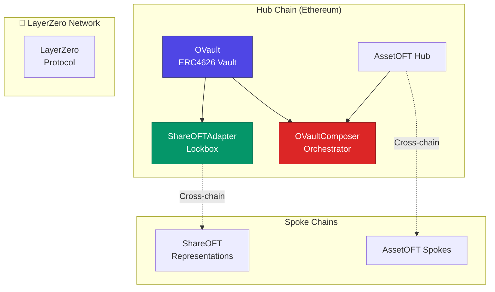
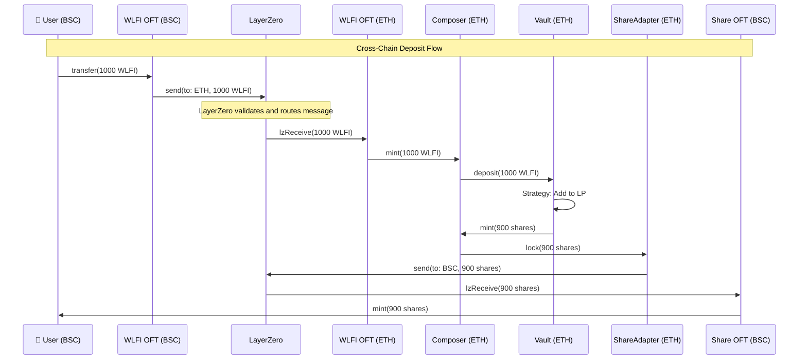
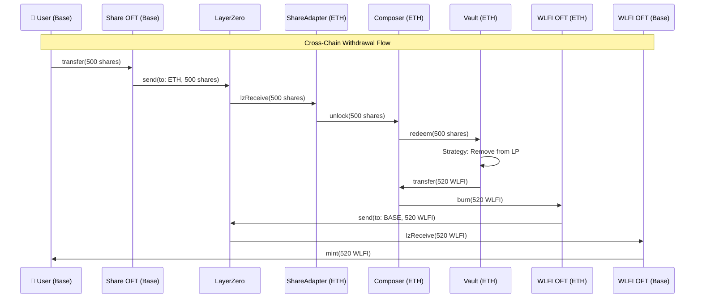

# LayerZero Integration

Learn how Eagle Vault leverages **LayerZero V2** for seamless omnichain operations.

## What is LayerZero?

LayerZero is a **full-stack interoperability protocol** that enables omnichain applications to move data and value across different blockchains with native-like user experiences.

### **Key Benefits for Eagle Vault**
- **Security**: Immutable smart contracts, no trusted validators
- **Speed**: Messages delivered in 1-3 minutes
- **Cost Effective**: Optimized gas usage and message fees  
- **Universal**: Works across 50+ blockchains
- **Developer Friendly**: Simple, standardized interfaces

## LayerZero OVault Pattern

Eagle Vault implements the **official LayerZero OVault pattern** - a standardized approach for omnichain vaults.

### **Core Components**



## OFT (Omnichain Fungible Token) Standard

### **What are OFTs?**
OFTs are tokens that exist natively across multiple blockchains, maintaining a unified total supply while allowing seamless cross-chain transfers.

### **Eagle's OFT Implementation**

#### **Asset OFTs (WLFI & USD1)**
```solidity
contract WLFIAssetOFT is OFT {
    constructor(
        string memory _name,
        string memory _symbol,
        address _lzEndpoint,
        address _delegate
    ) OFT(_name, _symbol, _lzEndpoint, _delegate) {}
}
```

**Features:**
- **Unified Supply**: Single total supply across all chains
- **Native Transfers**: Direct cross-chain token movement
- **Gas Efficient**: Optimized LayerZero messaging

#### **Share OFT (Vault Shares)**
```solidity
contract EagleShareOFT is OFT {
    // Spoke chain share representation
    // WARNING: Never mint directly - breaks vault accounting
}
```

**Special Considerations:**
- **Lockbox Model**: Hub chain locks shares, spokes mint representations
- **Accounting Integrity**: Maintains proper vault `totalSupply()` calculation
- **Cross-Chain Access**: Enables vault management from any chain

## 🔄 **Cross-Chain Message Flows**

### **Deposit Flow: Spoke → Hub**



### **Withdrawal Flow: Spoke → Hub**



## LayerZero Configuration

### **Endpoint Addresses**
```typescript
export const LAYERZERO_ENDPOINTS = {
  ethereum: '0x1a44076050125825900e736c501f859c50fE728c',
  bsc: '0x1a44076050125825900e736c501f859c50fE728c',
  arbitrum: '0x1a44076050125825900e736c501f859c50fE728c',
  base: '0x1a44076050125825900e736c501f859c50fE728c',
  avalanche: '0x1a44076050125825900e736c501f859c50fE728c',
} as const;

export const LAYERZERO_CHAIN_IDS = {
  ethereum: 30101,
  bsc: 30102,
  arbitrum: 30110,
  base: 30184,
  avalanche: 30106,
} as const;
```

### **Trusted Remote Setup**
```solidity
// Configure trusted remotes for cross-chain communication
function setTrustedRemoteAddress(
    uint32 _remoteEid,
    bytes32 _remoteAddress
) external onlyOwner {
    trustedRemoteLookup[_remoteEid] = _remoteAddress;
    emit SetTrustedRemoteAddress(_remoteEid, _remoteAddress);
}
```

### **Message Options**
```solidity
// Configure gas limits and message options
bytes memory options = OptionsBuilder.newOptions()
    .addExecutorLzReceiveOption(200000, 0) // 200k gas limit
    .addExecutorNativeDropOption(0.01 ether, recipient); // Native drop
```

## Fee Structure & Economics

### **LayerZero Fee Calculation**
```solidity
function quoteCrossChain(
    uint32 dstEid,
    uint256 amount,
    bytes calldata options
) external view returns (MessagingFee memory) {
    return _quote(dstEid, _encodeMessage(amount), options, false);
}
```

### **Fee Components**
- **Protocol Fee**: LayerZero network fee (~$0.10-$2.00)
- **Executor Fee**: Gas cost on destination chain
- **Native Drop** (optional): Native tokens for user on destination

### **Gas Optimization**
```solidity
// Batch multiple operations to reduce fees
struct BatchParams {
    address[] recipients;
    uint256[] amounts;
    uint32[] dstEids;
}

function batchTransfer(BatchParams calldata params) external payable {
    // Process all transfers in single transaction
}
```

## 🔒 **Security Considerations**

### **Message Validation**
```solidity
function _lzReceive(
    Origin calldata _origin,
    bytes32 _guid,
    bytes calldata _message,
    address _executor,
    bytes calldata _extraData
) internal override {
    // Validate message origin
    require(trustedRemoteLookup[_origin.srcEid] != bytes32(0), "Untrusted source");
    
    // Decode and validate message
    (uint256 amount, address recipient) = abi.decode(_message, (uint256, address));
    require(amount > 0, "Invalid amount");
    require(recipient != address(0), "Invalid recipient");
    
    // Process message
    _mint(recipient, amount);
}
```

### **Retry Mechanism**
```solidity
// Handle failed messages with manual retry
function retryMessage(
    uint32 _srcEid,
    bytes32 _sender,
    uint64 _nonce,
    bytes calldata _message
) external payable {
    // Retry failed cross-chain message
    lzEndpoint.retry(_srcEid, _sender, _nonce, _message);
}
```

## 🧪 **Testing LayerZero Integration**

### **Local Development**
```bash
# Test cross-chain messaging locally
npx hardhat test:layerzero --source ethereum --dest bsc

# Simulate message delivery
npx hardhat simulate:layerzero --tx 0xabc... --network ethereum
```

### **Testnet Validation**
```typescript
// Test suite for LayerZero integration
describe('LayerZero Integration', () => {
  it('should handle cross-chain deposits', async () => {
    const tx = await wlfiOFT.send(
      bscEid, 
      encodedMessage, 
      options, 
      { value: fee }
    );
    
    // Validate LayerZero message
    expect(await getMessageStatus(tx.hash)).to.equal('DELIVERED');
  });
});
```

## Monitoring & Analytics

### **Cross-Chain Metrics**
```solidity
event CrossChainSend(
    uint32 indexed dstEid,
    bytes32 indexed guid,
    uint256 amount,
    address recipient
);

event CrossChainReceive(
    uint32 indexed srcEid,
    bytes32 indexed guid,
    uint256 amount,
    address recipient
);
```

### **LayerZero Scanner Integration**
```typescript
// Monitor cross-chain transactions
const scannerConfig = {
  networks: ['ethereum', 'bsc', 'arbitrum', 'base', 'avalanche'],
  contracts: {
    wlfiOFT: WLFI_ADDRESSES,
    usd1OFT: USD1_ADDRESSES,
    shareOFT: SHARE_ADDRESSES,
  }
};
```

## Advanced Features

### **Composed Calls**
```solidity
// Execute multiple operations atomically
function composeDeposit(ComposeParams calldata params) external payable {
    // 1. Receive assets via LayerZero
    // 2. Deposit into vault
    // 3. Send shares back via LayerZero
    // All in single atomic transaction
}
```

### **Native Drops**
```solidity
// Automatically provide native gas tokens
bytes memory options = OptionsBuilder.newOptions()
    .addExecutorNativeDropOption(0.01 ether, recipient);
```

### **Executor Options**
```typescript
// Custom gas limits for different operations
const executorOptions = {
  deposit: { gasLimit: 300000, value: 0 },
  withdraw: { gasLimit: 400000, value: 0 },
  rebalance: { gasLimit: 500000, value: 0 },
};
```

## Development Tools

### **LayerZero Devtools**
```bash
# Install LayerZero CLI
npm install -g @layerzerolabs/devtools

# Deploy OFT contracts
npx layerzero deploy:oft --network ethereum
npx layerzero deploy:oft --network bsc

# Configure trusted remotes
npx layerzero config:set-remotes --network ethereum
```

### **Hardhat Integration**
```typescript
// Hardhat task for LayerZero operations
task('layerzero:send', 'Send cross-chain message')
  .addParam('to', 'Destination chain')
  .addParam('amount', 'Amount to send')
  .setAction(async (args, hre) => {
    // Implementation
  });
```

---

**LayerZero integration enables Eagle Vault to provide a truly omnichain experience with security, speed, and cost efficiency.**

