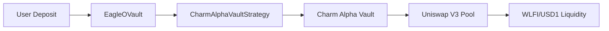

# CharmAlphaVaultStrategy Contract

The **CharmAlphaVaultStrategy** is a sophisticated adapter contract that integrates 47 Eagle Finance with Charm Finance Alpha Vaults, enabling professional Uniswap V3 liquidity management with enhanced yield generation capabilities.

## 📋 **Contract Overview**

```solidity
contract CharmAlphaVaultStrategy is ReentrancyGuard, Ownable {
    using SafeERC20 for IERC20;

    // Core integration components
    address public immutable EAGLE_VAULT;
    IAlphaProVault public alphaVault;
    IAlphaProVaultFactory public immutable ALPHA_FACTORY;
    
    // Strategy assets
    IERC20 public immutable WLFI_TOKEN;
    IERC20 public immutable USD1_TOKEN;
    
    // Strategic configuration
    uint24 public poolFee = 10000; // Premium fee tier
    uint256 public maxSlippage = 500; // 5% max slippage protection
    uint256 public rebalanceThreshold = 1000; // 10% deviation triggers rebalance
}
```

## 🏗️ **Architecture Integration**

### **Role in the Ecosystem**

The CharmAlphaVaultStrategy serves as a **strategic adapter layer** between:

- **EagleOVault (ERC4626)** ← Interface → **CharmAlphaVaultStrategy** ← Interface → **Charm Alpha Vault**

### **Integration Flow**



## 🔌 **Charm Finance Interfaces**

### **IAlphaProVault Interface**

```solidity
interface IAlphaProVault {
    function deposit(
        uint256 amount0Desired,  // WLFI amount
        uint256 amount1Desired,  // USD1 amount
        uint256 amount0Min,      // Minimum WLFI (slippage protection)
        uint256 amount1Min,      // Minimum USD1 (slippage protection)
        address recipient
    ) external returns (
        uint256 shares, 
        uint256 amount0Used, 
        uint256 amount1Used
    );
    
    function withdraw(
        uint256 shares,          // Alpha Vault shares to redeem
        uint256 amount0Min,      // Minimum WLFI output
        uint256 amount1Min,      // Minimum USD1 output
        address recipient
    ) external returns (uint256 amount0, uint256 amount1);
    
    function getTotalAmounts() external view returns (uint256 total0, uint256 total1);
    function balanceOf(address account) external view returns (uint256);
    function totalSupply() external view returns (uint256);
    function token0() external view returns (address);
    function token1() external view returns (address);
}
```

### **IAlphaProVaultFactory Interface**

```solidity
interface IAlphaProVaultFactory {
    function createVault(
        address token0,          // WLFI token address
        address token1,          // USD1 token address
        uint24 fee,             // Premium fee tier (10000 = 1%)
        uint256 maxTotalSupply  // Maximum vault capacity
    ) external returns (address vault);
    
    function getVault(
        address token0,
        address token1,
        uint24 fee
    ) external view returns (address);
}
```

## ⚙️ **Core Functions**

### **Strategy Initialization**

```solidity
function initializeVault(uint256 maxTotalSupply) external onlyOwner {
    require(address(alphaVault) == address(0), "Vault already initialized");
    
    // Get or create the Alpha Vault for WLFI/USD1 pair
    address existingVault = ALPHA_FACTORY.getVault(
        address(WLFI_TOKEN),
        address(USD1_TOKEN),
        poolFee
    );
    
    if (existingVault != address(0)) {
        alphaVault = IAlphaProVault(existingVault);
    } else {
        // Create new vault if it doesn't exist
        address newVault = ALPHA_FACTORY.createVault(
            address(WLFI_TOKEN),
            address(USD1_TOKEN),
            poolFee,
            maxTotalSupply
        );
        alphaVault = IAlphaProVault(newVault);
        emit VaultCreated(newVault, address(WLFI_TOKEN), address(USD1_TOKEN), poolFee);
    }
    
    active = true;
}
```

### **Strategic Deposit Function**

```solidity
function deposit(
    uint256 wlfiAmount,
    uint256 usd1Amount
) external onlyVault whenActive nonReentrant returns (uint256 shares) {
    if (wlfiAmount == 0 && usd1Amount == 0) return 0;
    
    // Transfer tokens from EagleOVault
    if (wlfiAmount > 0) {
        WLFI_TOKEN.safeTransferFrom(EAGLE_VAULT, address(this), wlfiAmount);
    }
    if (usd1Amount > 0) {
        USD1_TOKEN.safeTransferFrom(EAGLE_VAULT, address(this), usd1Amount);
    }
    
    // Approve Alpha Vault to spend tokens
    if (wlfiAmount > 0) {
        WLFI_TOKEN.safeIncreaseAllowance(address(alphaVault), wlfiAmount);
    }
    if (usd1Amount > 0) {
        USD1_TOKEN.safeIncreaseAllowance(address(alphaVault), usd1Amount);
    }
    
    // Calculate minimum amounts with slippage protection
    uint256 amount0Min = (wlfiAmount * (10000 - maxSlippage)) / 10000;
    uint256 amount1Min = (usd1Amount * (10000 - maxSlippage)) / 10000;
    
    // Deploy capital to Charm Alpha Vault
    (shares, , ) = alphaVault.deposit(
        wlfiAmount,
        usd1Amount,
        amount0Min,
        amount1Min,
        address(this)
    );
    
    emit StrategyDeposit(wlfiAmount, usd1Amount, shares);
}
```

### **Strategic Withdrawal Function**

```solidity
function withdraw(
    uint256 shares
) external onlyVault whenActive nonReentrant returns (uint256 wlfiAmount, uint256 usd1Amount) {
    if (shares == 0) return (0, 0);
    
    require(alphaVault.balanceOf(address(this)) >= shares, "Insufficient shares");
    
    // Calculate minimum amounts with slippage protection
    (uint256 total0, uint256 total1) = alphaVault.getTotalAmounts();
    uint256 totalShares = alphaVault.totalSupply();
    
    uint256 expectedAmount0 = (total0 * shares) / totalShares;
    uint256 expectedAmount1 = (total1 * shares) / totalShares;
    
    uint256 amount0Min = (expectedAmount0 * (10000 - maxSlippage)) / 10000;
    uint256 amount1Min = (expectedAmount1 * (10000 - maxSlippage)) / 10000;
    
    // Withdraw from Alpha Vault
    (wlfiAmount, usd1Amount) = alphaVault.withdraw(
        shares,
        amount0Min,
        amount1Min,
        EAGLE_VAULT // Send directly back to EagleOVault
    );
    
    emit StrategyWithdraw(shares, wlfiAmount, usd1Amount);
}
```

### **Professional Rebalancing**

```solidity
function rebalance() external onlyVault whenActive nonReentrant {
    // Charm Alpha Vaults handle rebalancing internally
    // This function can be used to trigger manual rebalancing if needed
    
    (uint256 total0, uint256 total1) = alphaVault.getTotalAmounts();
    lastRebalance = block.timestamp;
    
    emit StrategyRebalanced(total0, total1);
}
```

## 📊 **View Functions**

### **Strategy Value Calculation**

```solidity
function getTotalAmounts() external view returns (uint256 wlfiAmount, uint256 usd1Amount) {
    if (!active || address(alphaVault) == address(0)) {
        return (0, 0);
    }
    
    uint256 ourShares = alphaVault.balanceOf(address(this));
    if (ourShares == 0) {
        return (0, 0);
    }
    
    (uint256 total0, uint256 total1) = alphaVault.getTotalAmounts();
    uint256 totalShares = alphaVault.totalSupply();
    
    wlfiAmount = (total0 * ourShares) / totalShares;
    usd1Amount = (total1 * ourShares) / totalShares;
}
```

### **Share Balance Tracking**

```solidity
function getShares() external view returns (uint256) {
    if (!active || address(alphaVault) == address(0)) {
        return 0;
    }
    return alphaVault.balanceOf(address(this));
}
```

### **Initialization Status**

```solidity
function isInitialized() external view returns (bool) {
    return active && address(alphaVault) != address(0);
}
```

## 🛡️ **Security Features**

### **Access Control**

```solidity
modifier onlyVault() {
    if (msg.sender != EAGLE_VAULT) revert OnlyVault();
    _;
}

modifier whenActive() {
    if (!active) revert VaultNotActive();
    _;
}
```

### **Slippage Protection**

The contract implements comprehensive slippage protection:

```solidity
// Configurable slippage limits
uint256 public maxSlippage = 500; // 5% default

// Applied to all operations
uint256 amount0Min = (expectedAmount0 * (10000 - maxSlippage)) / 10000;
uint256 amount1Min = (expectedAmount1 * (10000 - maxSlippage)) / 10000;
```

### **Emergency Controls**

```solidity
function pause() external onlyOwner {
    active = false;
}

function resume() external onlyOwner {
    require(address(alphaVault) != address(0), "Vault not initialized");
    active = true;
}

function rescueToken(address token, uint256 amount, address to) external onlyOwner {
    IERC20(token).safeTransfer(to, amount);
}
```

## ⚡ **Events**

### **Strategy Events**

```solidity
event VaultCreated(
    address indexed alphaVault, 
    address token0, 
    address token1, 
    uint24 fee
);

event StrategyDeposit(
    uint256 wlfiAmount, 
    uint256 usd1Amount, 
    uint256 shares
);

event StrategyWithdraw(
    uint256 shares, 
    uint256 wlfiAmount, 
    uint256 usd1Amount
);

event StrategyRebalanced(
    uint256 newTotal0, 
    uint256 newTotal1
);
```

## 🔧 **Configuration Parameters**

### **Strategic Parameters**

```solidity
struct StrategyConfig {
    uint24 poolFee;              // Premium fee tier (10000 = 1%)
    uint256 maxSlippage;         // Maximum acceptable slippage (500 = 5%)
    uint256 rebalanceThreshold;  // Deviation threshold for rebalancing (1000 = 10%)
}
```

### **Parameter Updates**

```solidity
function updateParameters(
    uint256 _maxSlippage,
    uint256 _rebalanceThreshold
) external onlyOwner {
    require(_maxSlippage <= 1000, "Slippage too high"); // Max 10%
    require(_rebalanceThreshold <= 2000, "Threshold too high"); // Max 20%
    
    maxSlippage = _maxSlippage;
    rebalanceThreshold = _rebalanceThreshold;
}
```

## 💼 **Integration Examples**

### **EagleOVault Integration**

```solidity
// In EagleOVault contract
CharmAlphaVaultStrategy public charmStrategy;

function _deployToStrategy(uint256 wlfiAmount, uint256 usd1Amount) internal {
    // Transfer tokens to strategy
    WLFI.safeTransfer(address(charmStrategy), wlfiAmount);
    USD1.safeTransfer(address(charmStrategy), usd1Amount);
    
    // Deploy to Charm Alpha Vaults
    uint256 shares = charmStrategy.deposit(wlfiAmount, usd1Amount);
    
    // Track strategy allocation
    strategyShares += shares;
}
```

### **External Integration Pattern**

```solidity
// For external contracts integrating with the strategy
contract ExternalIntegrator {
    CharmAlphaVaultStrategy public strategy;
    
    function getStrategyValue() external view returns (uint256 totalValue) {
        (uint256 wlfiAmount, uint256 usd1Amount) = strategy.getTotalAmounts();
        
        // Convert to USD value using oracle prices
        totalValue = (wlfiAmount * getWLFIPrice()) + (usd1Amount * getUSD1Price());
    }
    
    function isStrategyHealthy() external view returns (bool) {
        return strategy.isInitialized() && strategy.getShares() > 0;
    }
}
```

## 🎯 **Best Practices**

### **For Developers**

1. **Always check initialization** before calling strategy functions
2. **Monitor slippage parameters** for optimal execution
3. **Handle emergency states** gracefully in integrating contracts
4. **Use view functions** to validate strategy state before operations

### **For Integrators**

```solidity
// Example integration pattern
function integrateWithCharmStrategy() external {
    // 1. Verify strategy is initialized
    require(strategy.isInitialized(), "Strategy not ready");
    
    // 2. Check current strategy value
    (uint256 wlfi, uint256 usd1) = strategy.getTotalAmounts();
    
    // 3. Perform operations with proper error handling
    try strategy.deposit(wlfiAmount, usd1Amount) returns (uint256 shares) {
        // Handle successful deposit
        emit StrategyDepositSuccess(shares);
    } catch Error(string memory reason) {
        // Handle known errors
        emit StrategyDepositFailed(reason);
    }
}
```

## 📚 **Related Documentation**

- **[Charm Finance Integration](../concepts/charm-finance-integration)** - Complete integration overview
- **[EagleOVault Contract](./eagle-ovault)** - Main vault contract documentation
- **[Architecture Deep Dive](../dev/architecture)** - System architecture details
- **[LayerZero Integration](../concepts/layerzero-integration)** - Cross-chain functionality

## 🔗 **External Resources**

- **[Charm Finance Alpha Vaults](https://learn.charm.fi/charm/products-overview/alpha-vaults)** - Official documentation
- **[Charm Finance Contracts](https://learn.charm.fi/charm/links/contracts)** - Contract addresses
- **[Uniswap V3 Documentation](https://docs.uniswap.org/protocol/V3/introduction)** - Underlying protocol
- **[OpenZeppelin Contracts](https://docs.openzeppelin.com/contracts/)** - Security libraries used

## 🎬 **Conclusion**

The CharmAlphaVaultStrategy contract represents a sophisticated integration between 47 Eagle Finance and Charm Finance Alpha Vaults, providing:

- **Professional yield management** through proven Charm Finance algorithms
- **Strategic positioning** in carefully selected fee tiers  
- **Institutional-grade security** with comprehensive safeguards
- **Seamless integration** with the broader 47 Eagle ecosystem
- **Developer-friendly interfaces** for external integration

This contract enables 47 Eagle Finance to offer enhanced yield opportunities while maintaining the highest standards of security and professional management.
