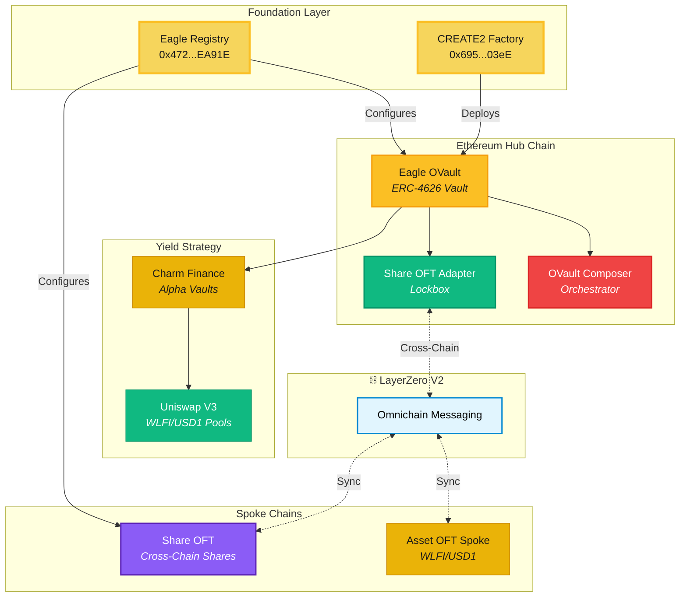
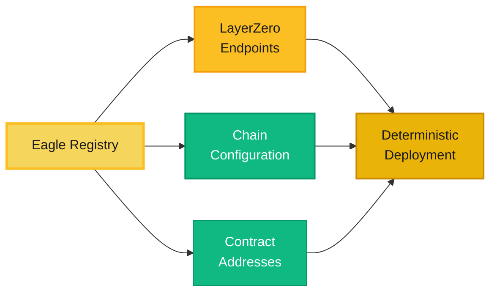
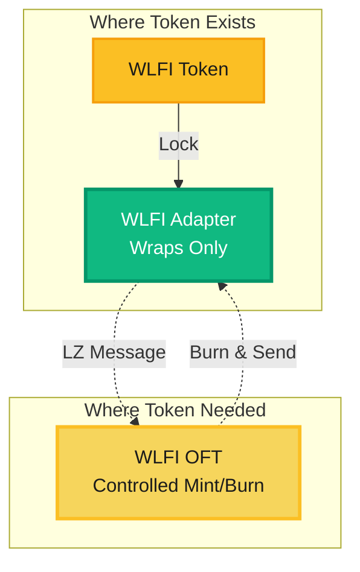
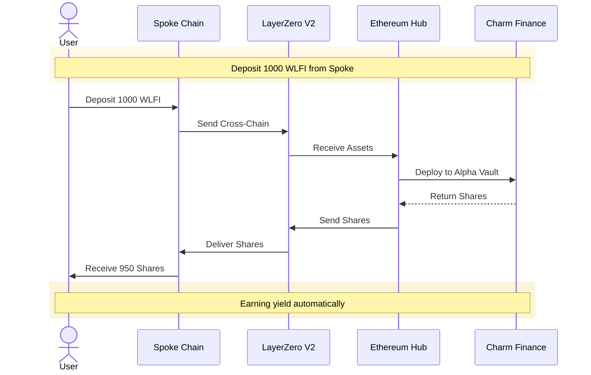
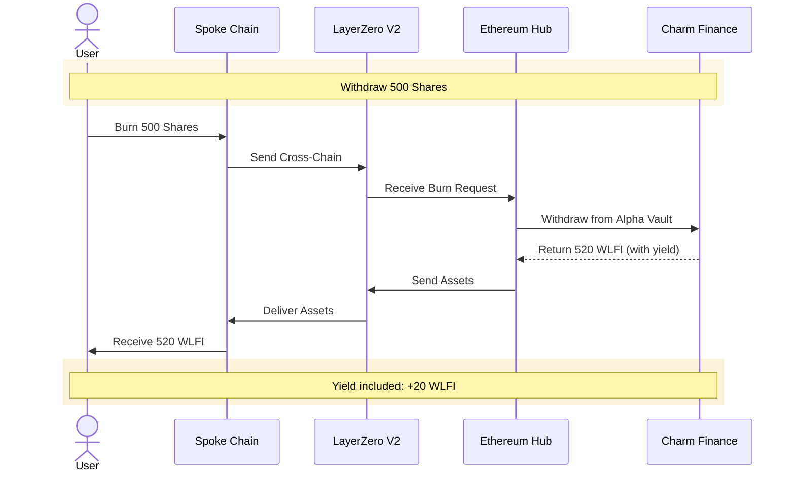
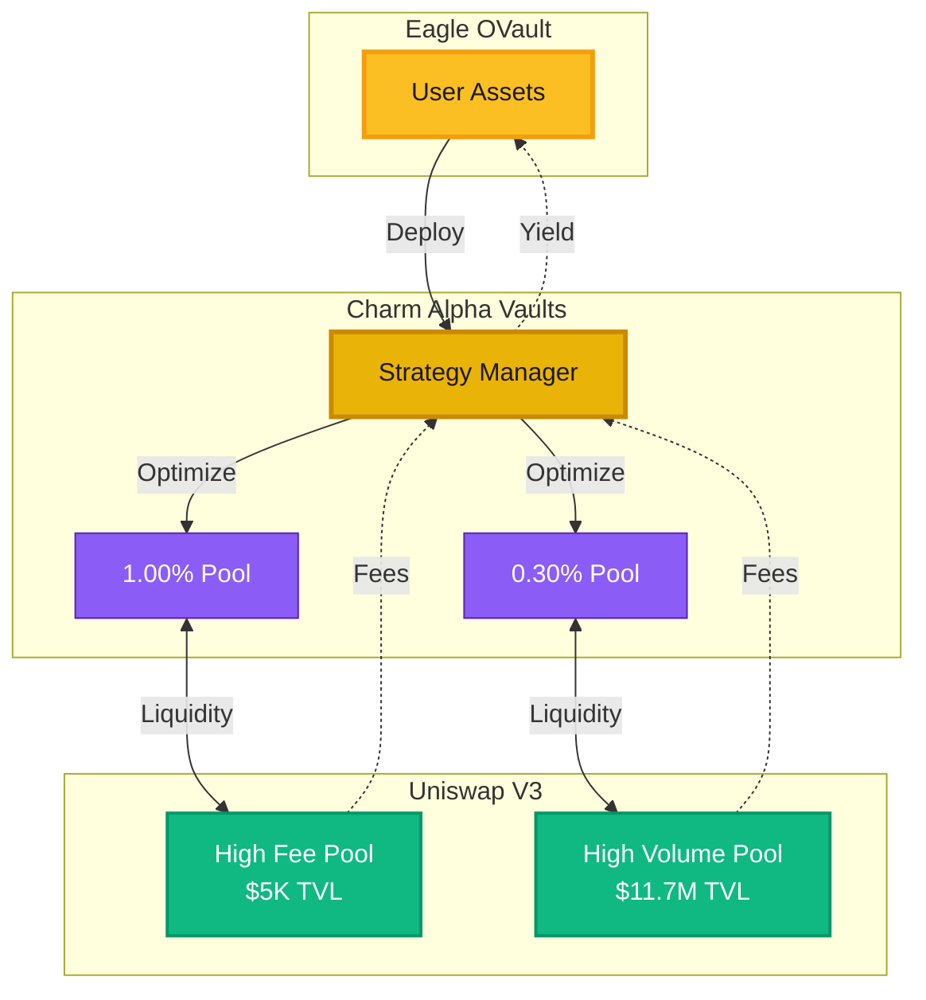
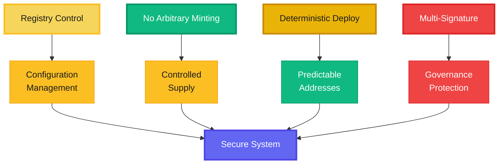
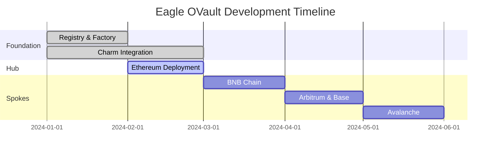

# Eagle Vault System Architecture

**Registry-based omnichain infrastructure powered by LayerZero V2**

A comprehensive technical overview of the Eagle Omnichain Vault architecture, implementing the LayerZero OVault pattern with deterministic cross-chain deployment.

---

## Architecture Overview



---

## Core Principles

### 1. Registry-First Design

The Eagle Registry serves as the central configuration hub for the entire omnichain system.



**Benefits:**
- Single source of truth for all chain configurations
- Easy endpoint updates without contract redeployment
- Deterministic addresses across all chains
- Simplified multi-chain management

### 2. No Arbitrary Minting

Security-first approach to token economics:



**Security Model:**
- **Adapters**: Lock/unlock existing tokens (Ethereum, BNB Chain)
- **OFTs**: Mint/burn only when cross-chain transfer occurs
- **Total Supply**: Constant across all chains combined

---

## Deployed Infrastructure

| Contract | Address | Status |
|----------|---------|--------|
| **Eagle Registry** | `0x472656c76f45e8a8a63fffd32ab5888898eea91e` |  Live |
| **CREATE2 Factory** | `0x695d6B3628B4701E7eAfC0bc511CbAF23f6003eE` |  Live |
| **Ethereum Hub** | `0x47...EA91E` (Target) |  In Progress |

---

## Cross-Chain Workflows

### Deposit Flow



### Withdrawal Flow



---

## Contract Architecture

### Adapters (Existing Tokens)

```solidity
// Wraps existing WLFI for cross-chain transfers
contract WLFIAdapter is OFTAdapter {
    constructor(
        address _token,      // Existing WLFI
        address _lzEndpoint, // LayerZero
        address _delegate    // Owner
    ) OFTAdapter(_token, _lzEndpoint, _delegate) {}
    
    // Only locks/unlocks - no minting
}
```

### OFTs (New Chains)

```solidity
// Native omnichain vault shares
contract EagleShareOFT is OFT {
    IChainRegistry public immutable registry;
    
    constructor(address _registry) {
        registry = IChainRegistry(_registry);
    }
    
    // Mints when receiving cross-chain
    // Burns when sending back
}
```

### Composers (Orchestration)

```solidity
// Multi-step cross-chain operations
contract EagleOVaultComposer {
    function composeDeposit(
        uint32 _dstEid,
        uint256 _amount,
        address _recipient
    ) external payable {
        // 1. Receive assets
        // 2. Vault deposit  
        // 3. Cross-chain shares
    }
}
```

---

## Charm Finance Integration



### Active Strategy Pools

| Pool | Fee Tier | TVL | 24h Volume | Strategy |
|------|----------|-----|------------|----------|
| WLFI/USD1 | 1.00% | $5,348 | $767,477 | High fee capture |
| WLFI/USD1 | 0.30% | $11.7M | $399.8M | Volume efficiency |

---

## Security Model



**Key Features:**
1. **Registry Control**: Centralized endpoint management
2. **No Arbitrary Minting**: Adapters wrap, OFTs mint only on transfer
3. **Deterministic Addresses**: CREATE2 for consistency
4. **Multi-Signature**: Consensus for critical operations

---

## Development Roadmap



### Current Status

**Phase 1 - Foundation**  Completed
- Registry deployment
- CREATE2 factory
- Charm integration

**Phase 2 - Hub**  In Progress
- Ethereum vault
- Orchestration layer
- Security audits

**Phase 3 - Spokes**  Planned
- Multi-chain deployment
- Cross-chain testing
- Production launch

---

## Technical Resources

- **Registry**: `0x472656c76f45e8a8a63fffd32ab5888898eea91e`
- **Factory**: `0x695d6B3628B4701E7eAfC0bc511CbAF23f6003eE`
- **GitHub**: [47-Eagle Organization](https://github.com/47-Eagle)
- **LayerZero**: [V2 Documentation](https://docs.layerzero.network)
- **Charm**: [Alpha Vaults](https://alpha.charm.fi)

---

*Building secure, scalable omnichain infrastructure with LayerZero V2 and registry-based architecture.*
