# System Architecture

Deep dive into the **Eagle Omnichain Vault** architecture - a clean implementation of LayerZero's OVault pattern with enterprise-grade features.

## 🎯 **Design Philosophy**

The Eagle Vault follows these core principles:

- **🏗️ Standards Compliance**: Pure LayerZero OVault implementation
- **🔒 Security First**: Production-ready security features
- **⚡ Gas Efficiency**: Optimized for cross-chain operations
- **🌐 Omnichain Native**: Seamless multi-chain experience
- **💎 Value Maximization**: Dual-token Uniswap V3 LP strategy

## 🏛️ **Hub-Spoke Architecture**

### **Hub Chain: Ethereum**
The hub chain hosts the core vault logic and asset management:

```mermaid
graph TB
    subgraph "🏛️ Ethereum Hub Chain"
        subgraph "💰 Asset Management"
            WLFI[WLFI Token<br/>AssetOFT Hub]
            USD1[USD1 Token<br/>AssetOFT Hub]
            UV3[Uniswap V3<br/>LP Pool]
        end
        
        subgraph "🏦 Vault Core"
            EV[EagleOVault<br/>ERC4626 + Strategy]
            SA[ShareOFTAdapter<br/>Lockbox Pattern]
        end
        
        subgraph "🎭 Orchestration"
            EC[EagleComposer<br/>Cross-Chain Coordinator]
        end
        
        WLFI <--> UV3
        USD1 <--> UV3
        UV3 <--> EV
        EV <--> SA
        EV <--> EC
        WLFI <--> EC
        USD1 <--> EC
    end
    
    style EV fill:#4f46e5,stroke:#312e81,color:#fff
    style SA fill:#059669,stroke:#047857,color:#fff
    style EC fill:#dc2626,stroke:#991b1b,color:#fff
    style UV3 fill:#ff6b9d,stroke:#d63384,color:#fff
```



### **Spoke Chains: BSC, Arbitrum, Base, Avalanche**
Spoke chains provide user access points and local token representations:


## 🔄 **Cross-Chain Communication Flow**

### **LayerZero Integration Pattern**


## 📋 **Contract Specifications**

### **EagleOVault.sol** - Core Vault Logic

```solidity
contract EagleOVault is ERC4626, Ownable, ReentrancyGuard, Pausable {
    // Dual-token strategy implementation
    IERC20 public immutable WLFI;
    IERC20 public immutable USD1;
    IUniswapV3Pool public immutable pool;
    
    // Strategy parameters
    uint256 public maxSlippage = 500; // 5%
    uint256 public rebalanceThreshold = 200; // 2%
    uint32 public twapPeriod = 3600; // 1 hour
    
    // Access control
    mapping(address => bool) public managers;
    mapping(address => bool) public authorizedUsers;
}
```

**Key Features:**
- **ERC4626 Compliance**: Standard tokenized vault interface
- **Dual-Token Strategy**: WLFI + USD1 Uniswap V3 LP management
- **Security Features**: Reentrancy protection, slippage limits, TWAP validation
- **Access Control**: Multi-tier permission system

### **EagleShareOFTAdapter.sol** - Cross-Chain Share Bridge

```solidity
contract EagleShareOFTAdapter is OFTAdapter {
    EagleOVault public immutable vault;
    
    constructor(
        address _vault,
        address _token,
        address _lzEndpoint,
        address _owner
    ) OFTAdapter(_token, _lzEndpoint, _owner) {
        vault = EagleOVault(_vault);
    }
}
```

**Purpose:**
- **Lockbox Pattern**: Locks shares on hub, mints on spokes
- **Accounting Integrity**: Preserves vault `totalSupply()` calculation
- **Cross-Chain Access**: Enables spoke chain vault share management

### **EagleOVaultComposer.sol** - Operation Orchestrator

```solidity
contract EagleOVaultComposer is VaultComposerSync {
    EagleOVault public immutable vault;
    EagleShareOFTAdapter public immutable shareAdapter;
    WLFIAssetOFT public immutable wlfiOFT;
    USD1AssetOFT public immutable usd1OFT;
    
    // Cross-chain operation coordination
    function composeDeposit(ComposeDepositParams calldata params) external;
    function composeWithdraw(ComposeWithdrawParams calldata params) external;
}
```

**Functions:**
- **Cross-Chain Deposits**: Receives assets, deposits to vault, sends shares
- **Cross-Chain Withdrawals**: Receives shares, redeems from vault, sends assets
- **Batch Operations**: Efficient multi-step transaction coordination

## 💎 **Dual-Token Strategy**

### **Uniswap V3 LP Management**

The Eagle Vault implements a sophisticated LP strategy:


**Strategy Components:**
- **Position Management**: Dynamic tick range optimization
- **Fee Harvesting**: Automated fee collection and reinvestment
- **Rebalancing**: Price-based position adjustments
- **Slippage Protection**: TWAP-based price validation

### **Price Oracle Integration**

```solidity
function getTimeWeightedAveragePrice() internal view returns (uint256) {
    uint32[] memory secondsAgos = new uint32[](2);
    secondsAgos[0] = twapPeriod; // e.g., 3600 seconds
    secondsAgos[1] = 0;
    
    (int56[] memory tickCumulatives, ) = pool.observe(secondsAgos);
    
    int56 tickCumulativesDelta = tickCumulatives[1] - tickCumulatives[0];
    int24 timeWeightedAverageTick = int24(tickCumulativesDelta / int56(uint56(twapPeriod)));
    
    return TickMath.getSqrtRatioAtTick(timeWeightedAverageTick);
}
```

## 🔒 **Security Architecture**

### **Multi-Layer Security Model**


### **Access Control Matrix**

| Role | Deposit | Withdraw | Rebalance | Pause | Emergency |
|------|---------|----------|-----------|-------|-----------|
| **User** | ✅ | ✅ | ❌ | ❌ | ❌ |
| **Manager** | ✅ | ✅ | ✅ | ❌ | ❌ |
| **Owner** | ✅ | ✅ | ✅ | ✅ | ✅ |

## ⚡ **Gas Optimization Strategies**

### **Batch Operations**
```solidity
struct BatchDepositParams {
    uint256 wlfiAmount;
    uint256 usd1Amount;
    address recipient;
    uint32 dstEid;
    bytes calldata options;
}

function batchDeposit(BatchDepositParams[] calldata params) external {
    // Process multiple deposits in single transaction
}
```

### **Efficient Cross-Chain Messaging**
- **Payload Compression**: Minimize cross-chain message size
- **Batched Transfers**: Multiple operations in single LayerZero message
- **Gas Estimation**: Dynamic fee calculation for optimal costs

### **Storage Optimization**
- **Packed Structs**: Efficient storage layout
- **Immutable Variables**: Gas-efficient deployment
- **Event Indexing**: Optimized for frontend queries

## 🌐 **Network Topology**

### **LayerZero Endpoint Integration**

| Network | Chain ID | LZ EID | Endpoint Address |
|---------|----------|--------|------------------|
| **Ethereum** | 1 | 30101 | `0x1a44076050125825900e736c501f859c50fE728c` |
| **BSC** | 56 | 30102 | `0x1a44076050125825900e736c501f859c50fE728c` |
| **Arbitrum** | 42161 | 30110 | `0x1a44076050125825900e736c501f859c50fE728c` |
| **Base** | 8453 | 30184 | `0x1a44076050125825900e736c501f859c50fE728c` |
| **Avalanche** | 43114 | 30106 | `0x1a44076050125825900e736c501f859c50fE728c` |

### **Trust Configuration**
```solidity
// Example trusted remote configuration
mapping(uint32 => bytes32) public trustedRemoteLookup;

// Set trusted remotes for all chains
function setTrustedRemotes() external onlyOwner {
    trustedRemoteLookup[30102] = bytes32(uint256(uint160(bscAddress))); // BSC
    trustedRemoteLookup[30110] = bytes32(uint256(uint160(arbAddress))); // Arbitrum
    // ... other chains
}
```

## 📊 **Performance Characteristics**

### **Transaction Costs**
- **Local Deposit**: ~150,000 gas
- **Cross-Chain Deposit**: ~300,000 gas + LayerZero fees
- **Rebalance Operation**: ~250,000 gas
- **Emergency Pause**: ~50,000 gas

### **Cross-Chain Latency**
- **Fast Path**: 1-3 minutes (normal conditions)
- **Congested**: 5-15 minutes (high network load)
- **Failed Retry**: Automatic retry with exponential backoff

## 🔧 **Monitoring and Observability**

### **Key Metrics**
```solidity
event VaultDeposit(address indexed user, uint256 assets, uint256 shares);
event VaultWithdraw(address indexed user, uint256 assets, uint256 shares);
event CrossChainTransfer(uint32 indexed dstEid, uint256 amount, bytes32 guid);
event Rebalance(int24 newTick, uint256 wlfiAmount, uint256 usd1Amount);
event EmergencyPause(address indexed admin, string reason);
```

### **Health Check Functions**
```solidity
function getVaultHealth() external view returns (VaultHealth memory) {
    return VaultHealth({
        totalAssets: totalAssets(),
        totalSupply: totalSupply(),
        sharePrice: convertToAssets(1e18),
        lpPosition: getCurrentLPPosition(),
        crossChainBalances: getCrossChainBalances()
    });
}
```

## 🚀 **Scalability Considerations**

### **Future Enhancements**
- **Multi-Pool Support**: Additional LP strategies
- **Dynamic Fee Tiers**: Adaptive fee optimization
- **Governance Integration**: Community-driven parameter updates
- **Additional Chains**: Easy expansion to new networks

### **Upgrade Path**
```solidity
// Upgrade pattern for future enhancements
contract EagleOVaultV2 is EagleOVault {
    // New features while maintaining compatibility
    function newFeature() external {
        // Implementation
    }
}
```

---

**This architecture provides a robust foundation for omnichain DeFi operations while maintaining security, efficiency, and user experience.**

