# Eagle Vault System Architecture

Comprehensive technical overview of the **Eagle Omnichain Vault** - a sophisticated implementation of LayerZero's OVault pattern with enterprise-grade cross-chain infrastructure.

## Project Structure Overview

<div class="animate-fade-in-up">

```
eagle-ovault-clean/
├── contracts/                     # Smart Contracts
│   ├── layerzero-ovault/          # LayerZero Integration
│   │   ├── adapters/              # Token Adapters (wrap existing tokens)
│   │   │   ├── WLFIAdapter.sol    # WLFI token adapter
│   │   │   └── USD1Adapter.sol    # USD1 token adapter
│   │   ├── composers/             # Orchestration Contracts
│   │   │   └── EagleOVaultComposer.sol
│   │   └── oft/                   # Omnichain Fungible Tokens
│   │       └── EagleShareOFT.sol  # Cross-chain vault shares
│   └── interfaces/                # Contract Interfaces
│       ├── IChainRegistry.sol     # Registry interface
│       └── ICREATE2Factory.sol    # CREATE2 factory interface
├── scripts/                       # Deployment & Utility Scripts
│   ├── deploy-production-contracts.ts
│   ├── configure-real-registry.ts
│   ├── calculate-current-eagle-bytecode-hash.ts
│   └── check-registry.ts
├── vanity-generator/              # Rust Vanity Address Generator
│   ├── Cargo.toml
│   └── src/main.rs
└── docs/                          # Technical Documentation
```

</div>

## Design Philosophy

The Eagle Vault architecture is built on these foundational principles:

<div class="animate-fade-in-up">

:::tip **Registry-First Design**
Universal registry (`0x472656c76f45e8a8a63fffd32ab5888898eea91e`) provides chain-specific configurations, enabling true deterministic addresses across all supported networks.
:::

</div>

- **Standards Compliance**: Pure LayerZero OVault implementation
- **Deterministic Addresses**: CREATE2 factory enables consistent addressing
- **No Token Minting**: Respect existing token ecosystems via adapters
- **Security First**: Production-ready security features
- **Gas Efficiency**: Optimized for cross-chain operations

## Core Architecture Components

### 1. Registry-Based System

The architecture centers around a universal registry that provides chain-specific LayerZero configurations:

| Component | Address | Purpose |
|-----------|---------|---------|
| **Chain Registry** | `0x472656c76f45e8a8a63fffd32ab5888898eea91e` | LayerZero endpoint configuration |
| **CREATE2 Factory** | `0x695d6B3628B4701E7eAfC0bc511CbAF23f6003eE` | Deterministic contract deployment |
| **Target Address** | `0x47...EA91E` | Vanity address pattern (in progress) |

### 2. Contract Categories

#### **Adapters** (`contracts/layerzero-ovault/adapters/`)

```solidity
// Wraps existing WLFI/USD1 tokens for cross-chain functionality
contract WLFIAdapter is OFTAdapter {
    // No minting - only wraps existing tokens
}

contract USD1Adapter is OFTAdapter {
    // No minting - only wraps existing tokens  
}
```

**Purpose**: Enable cross-chain functionality for existing ERC20 tokens  
**Usage**: Chains where WLFI/USD1 already deployed (Ethereum, BSC)  
**Security**: No new token supply - only wraps/unwraps existing tokens

#### **OFTs** (`contracts/layerzero-ovault/oft/`)

```solidity
// Registry-integrated cross-chain vault shares
contract EagleShareOFT is OFT {
    IChainRegistry public immutable registry;
    
    constructor(address _registry) {
        registry = IChainRegistry(_registry);
        // Uses registry for LayerZero endpoint discovery
    }
}
```

**Purpose**: Native omnichain tokens with deterministic addresses  
**Registry Integration**: Uses `IChainRegistry` for endpoint configuration  
**Deployment**: Targeting vanity address pattern `0x47...EA91E`

#### **Composers** (`contracts/layerzero-ovault/composers/`)

```solidity
// Orchestrates cross-chain vault operations
contract EagleOVaultComposer is VaultComposerSync {
    // Coordinates Uniswap V3 liquidity strategies
    // Handles cross-chain deposit/withdrawal flows
}
```

## Hub-Spoke Architecture

### Hub Chain: Ethereum

The hub chain hosts core vault logic and asset management:


### Spoke Chains: BSC, Arbitrum, Base, Avalanche

Spoke chains provide user access points and local token representations:

```mermaid
graph TB
    subgraph "🌐 BSC Spoke Chain (Deployed)"
        subgraph "💰 Token Adapters"
            WA[WLFI Adapter<br/>Existing WLFI Bridge]
            UA[USD1 Adapter<br/>Existing USD1 Bridge]
        end
        
        subgraph "📜 Vault Shares"
            SO[EagleShareOFT<br/>0x0Ba80Ce1c8e4487C9EeA179150D09Ec2cbCb5Aa1]
        end
        
        subgraph "👤 User Interface"
            USER[Users<br/>Cross-Chain Operations]
        end
        
        USER --> WA
        USER --> UA
        USER --> SO
    end
    
    style WA fill:#f59e0b,stroke:#d97706,color:#fff
    style UA fill:#3b82f6,stroke:#2563eb,color:#fff
    style SO fill:#8b5cf6,stroke:#7c3aed,color:#fff
```



## Cross-Chain Communication Flow

### LayerZero Integration Pattern


## Deployment Strategy & Status

### Current Deployment Status

<div class="animate-fade-in-up">

| Phase | Network | Status | Details |
|-------|---------|--------|---------|
| **Phase 1** | BSC | ✅ **Deployed** | Registry configured, contracts live |
| **Phase 2** | Ethereum | 🔄 **In Progress** | Awaiting vanity address generation |
| **Phase 3** | Multi-Chain | ⏳ **Pending** | Cross-chain wiring after Ethereum |

</div>

### BSC Deployment (Completed)

```bash
# Registry Configuration
✅ Registry: 0x472656c76f45e8a8a63fffd32ab5888898eea91e
✅ EagleShareOFT: 0x0Ba80Ce1c8e4487C9EeA179150D09Ec2cbCb5Aa1
✅ WLFI/USD1 Adapters: Deployed with real token addresses
✅ Cross-chain messaging: Configured for LayerZero V2
```

### Vanity Address Generation

<div class="animate-fade-in-up">

:::note **Performance Metrics**
- **Target Pattern**: `0x47...EA91E` (7 hex characters)
- **Attempts Processed**: 220M+ (and counting)  
- **Generation Speed**: ~437,000 attempts/second
- **Estimated Completion**: Anytime (luck-dependent)
:::

</div>

```rust
// Vanity generation targeting elegant address pattern
// vanity-generator/src/main.rs
fn generate_vanity_address(target: &str, factory: &str) {
    // High-performance vanity address generation
    // Targeting 0x47...EA91E pattern for brand consistency
}
```

## Contract Specifications

### EagleOVault.sol - Core Vault Logic

```solidity
contract EagleOVault is ERC4626, Ownable, ReentrancyGuard, Pausable {
    // Dual-token strategy for WLFI + USD1
    IERC20 public immutable WLFI;
    IERC20 public immutable USD1;
    IUniswapV3Pool public immutable pool;
    
    // Strategy parameters
    uint256 public maxSlippage = 500;        // 5%
    uint256 public rebalanceThreshold = 200; // 2%
    uint32 public twapPeriod = 3600;         // 1 hour
    
    // Registry integration for cross-chain operations
    IChainRegistry public immutable registry;
    
    // No token minting - only manages existing WLFI/USD1
    mapping(address => bool) public managers;
    mapping(address => bool) public authorizedUsers;
}
```

**Key Features:**
- **ERC4626 Compliance**: Standard tokenized vault interface
- **Registry Integration**: Uses universal registry for configuration
- **Dual-Token Strategy**: WLFI + USD1 Uniswap V3 LP management
- **Security Features**: Reentrancy protection, slippage limits, TWAP validation
- **No Minting Policy**: Only manages existing token ecosystems

### EagleShareOFT.sol - Registry-Based Cross-Chain Shares

```solidity
contract EagleShareOFT is OFT {
    IChainRegistry public immutable registry;
    
    constructor(address _registry) OFT("Eagle Vault Shares", "EVS", msg.sender) {
        registry = IChainRegistry(_registry);
    }
    
    function _lzEndpoint() internal view override returns (address) {
        return registry.getEndpoint(block.chainid);
    }
    
    // Deterministic deployment via CREATE2 for consistent addresses
}
```

**Purpose:**
- **Registry-Based**: Dynamic LayerZero endpoint discovery
- **Deterministic**: CREATE2 deployment for consistent addresses
- **Native OFT**: New token representing vault ownership
- **Cross-Chain**: Seamless transfer across all supported networks

### Token Integration Strategy

#### Real Token Addresses (Environment Configuration)

```bash
# Production token addresses (.env)
WLFI_ETHEREUM=0x...    # Your deployed WLFI on Ethereum
USD1_ETHEREUM=0x...    # Your deployed USD1 on Ethereum  
WLFI_BSC=0x...         # Your deployed WLFI on BSC
USD1_BSC=0x...         # Your deployed USD1 on BSC
```

#### No Token Minting Policy

<div class="animate-fade-in-up">

:::warning **Token Policy**
**Adapters**: Wrap existing tokens (no new supply created)  
**Asset OFTs**: Not used (would mint new token supply)  
**EagleShareOFT**: Native vault shares (new token representing ownership)
:::

</div>

## Dual-Token Strategy

### Uniswap V3 LP Management

The Eagle Vault implements sophisticated LP strategy targeting the WLFI/USD1 pool:

**Pool Details:**
- **Address**: `0xf9f5e6f7a44ee10c72e67bded6654afaf4d0c85d`
- **Fee Tier**: 1% (10000)
- **Strategy**: Dynamic position management with automated rebalancing


### Price Oracle Integration

```solidity
function getTimeWeightedAveragePrice() internal view returns (uint256) {
    uint32[] memory secondsAgos = new uint32[](2);
    secondsAgos[0] = twapPeriod; // e.g., 3600 seconds
    secondsAgos[1] = 0;
    
    (int56[] memory tickCumulatives, ) = pool.observe(secondsAgos);
    
    int56 tickCumulativesDelta = tickCumulatives[1] - tickCumulatives[0];
    int24 timeWeightedAverageTick = int24(tickCumulativesDelta / int56(uint56(twapPeriod)));
    
    return TickMath.getSqrtRatioAtTick(timeWeightedAverageTick);
}
```

## Security Architecture

### Multi-Layer Security Model


### Access Control Matrix

| Role | Deposit | Withdraw | Rebalance | Registry Update | Emergency |
|------|---------|----------|-----------|-----------------|-----------|
| **User** | ✅ | ✅ | ❌ | ❌ | ❌ |
| **Manager** | ✅ | ✅ | ✅ | ❌ | ❌ |
| **Owner** | ✅ | ✅ | ✅ | ✅ | ✅ |

## Network Topology

### Supported Networks

| Network | Chain ID | LayerZero EID | Status | Role |
|---------|----------|---------------|---------|------|
| **Ethereum** | 1 | 30101 | 🎯 **Target** | Hub |
| **BSC** | 56 | 30102 | ✅ **Live** | Spoke |
| **Arbitrum** | 42161 | 30110 | 🎯 **Target** | Spoke |
| **Base** | 8453 | 30184 | 🎯 **Target** | Spoke |
| **Avalanche** | 43114 | 30106 | 🎯 **Target** | Spoke |

### LayerZero V2 Integration

All networks use LayerZero V2 endpoints:
- **Endpoint**: `0x1a44076050125825900e736c501f859c50fE728c`
- **DVN Security**: Multi-validator configuration
- **Enforced Options**: Gas safety and delivery guarantees

## Performance Characteristics

### Gas Optimization

- **Registry Caching**: Minimizes external calls for endpoint discovery
- **CREATE2 Deployment**: Predictable gas costs across networks
- **Adapter Pattern**: No token minting reduces gas overhead
- **Batch Operations**: Multiple actions in single transaction

### Transaction Costs

| Operation | Gas Estimate | Notes |
|-----------|--------------|--------|
| **Local Deposit** | ~150,000 gas | Direct vault interaction |
| **Cross-Chain Deposit** | ~300,000 gas + LZ fees | Via adapter pattern |
| **Rebalance** | ~250,000 gas | Uniswap V3 position management |
| **Registry Update** | ~50,000 gas | Configuration changes |

### Cross-Chain Latency

- **Fast Path**: 1-3 minutes (normal network conditions)
- **Congested**: 5-15 minutes (high network load)  
- **Failed Retry**: Automatic retry with exponential backoff

## Development Tools

### Deployment Scripts

```bash
# Configure registry with chain-specific endpoints
npx hardhat run scripts/configure-real-registry.ts --network bsc

# Deploy production contracts with real token addresses
npx hardhat run scripts/deploy-production-contracts.ts --network bsc

# Calculate bytecode hash for vanity generation
npx hardhat run scripts/calculate-current-eagle-bytecode-hash.ts

# Verify registry configuration
npx hardhat run scripts/check-registry.ts --network bsc
```

### Vanity Address Generation

```bash
# High-performance Rust-based vanity generation
cd vanity-generator
cargo run <bytecode_hash> <factory_address> 47 ea91e

# Current performance: ~437k attempts/second
# Target: 0x47...EA91E (Eagle brand consistency)
```

## Monitoring and Observability

### Key Events

```solidity
event VaultDeposit(address indexed user, uint256 assets, uint256 shares);
event CrossChainTransfer(uint32 indexed dstEid, uint256 amount, bytes32 guid);
event RegistryUpdate(uint256 indexed chainId, address newEndpoint);
event VanityDeployment(address indexed newAddress, bytes32 salt);
event EmergencyPause(address indexed admin, string reason);
```

### Health Check Functions

```solidity
function getSystemHealth() external view returns (SystemHealth memory) {
    return SystemHealth({
        registryAddress: address(registry),
        totalVaultAssets: totalAssets(),
        crossChainBalances: getCrossChainBalances(),
        vanityAddressStatus: checkVanityGeneration(),
        lpPositionHealth: getCurrentLPPosition()
    });
}
```

## Future Enhancements

### Scalability Roadmap

- **Multi-Pool Support**: Additional Uniswap V3 strategies
- **Dynamic Rebalancing**: AI-driven position optimization  
- **Governance Integration**: Community parameter updates
- **Additional Networks**: Easy expansion via registry updates

### Upgrade Strategy

The registry-based architecture enables seamless upgrades:

```solidity
// Registry enables dynamic endpoint updates
function updateChainEndpoint(uint256 chainId, address newEndpoint) external onlyOwner {
    registry.setEndpoint(chainId, newEndpoint);
    emit RegistryUpdate(chainId, newEndpoint);
}

// CREATE2 enables predictable upgrade addresses
function deployUpgrade(bytes32 salt) external returns (address) {
    address newImplementation = create2Factory.deploy(salt, bytecode);
    return newImplementation;
}
```

---

**This registry-based, deterministic architecture provides a robust foundation for omnichain DeFi operations while maintaining security, efficiency, and seamless cross-chain user experience.**