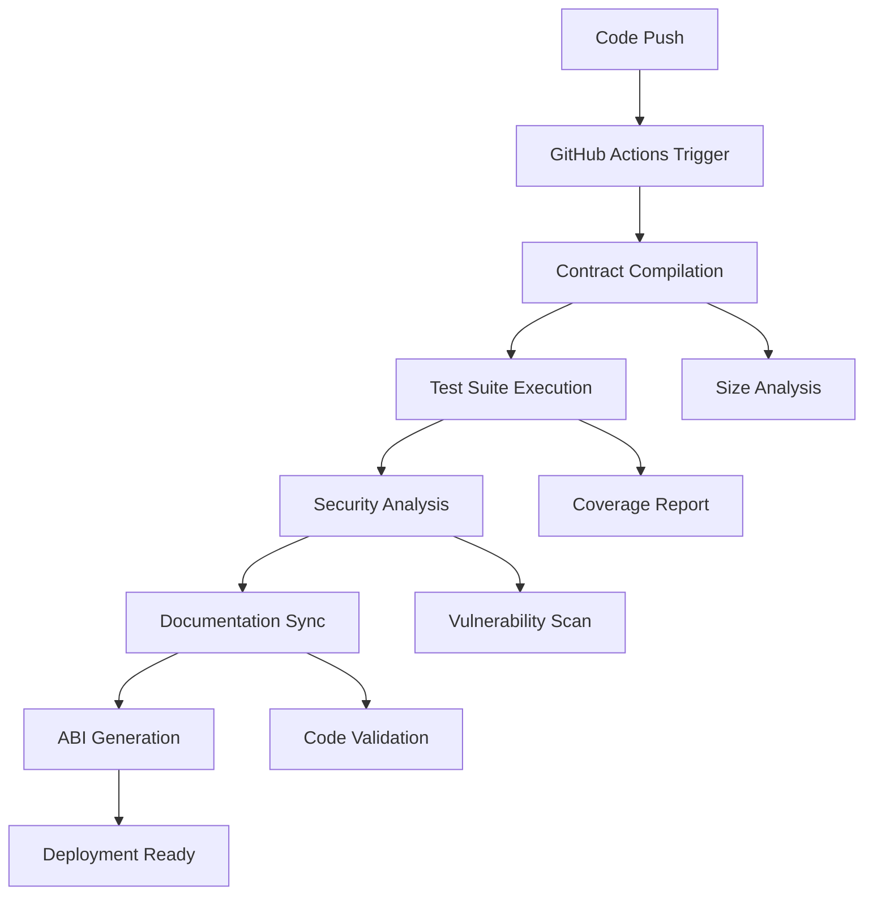

# CI/CD Pipeline

Enterprise-grade continuous integration and deployment pipeline for **47 Eagle Finance** smart contracts and documentation.

## Pipeline Overview

Our automated pipeline ensures code quality, security, and documentation accuracy through comprehensive validation and testing.



## Automated Workflows

### Contract Validation Workflow

**Trigger**: Push to `main` or `develop`, PRs, changes to contracts or docs

**Steps**:
1. **Foundry Setup** - Install latest Solidity toolchain
2. **Dependency Installation** - Node.js and contract dependencies  
3. **Compilation** - Full contract compilation with optimization
4. **Testing** - Comprehensive test suite execution
5. **Security Analysis** - Slither vulnerability scanning
6. **Documentation Validation** - Verify all code examples compile
7. **ABI Generation** - Extract and format contract interfaces
8. **Artifact Upload** - Store build outputs and reports

### Documentation Generation

**Trigger**: Successful validation on `main` branch

**Automation**:
- **Interface Extraction** - Real contract interfaces → docs
- **ABI Documentation** - Human-readable contract APIs
- **Example Validation** - All Solidity code blocks tested
- **Auto-commit** - Documentation stays synchronized

## Development Scripts

### Local Development

```bash
# Contract operations
npm run contracts:compile    # Compile all contracts
npm run contracts:test      # Run test suite
npm run contracts:validate  # Full validation pipeline

# Documentation operations  
npm run docs:validate-code  # Validate code examples
npm run docs:generate-abi   # Generate ABI documentation
npm run docs:sync-contracts # Sync with source code

# Security analysis
npm run security:slither    # Vulnerability analysis
npm run security:mythril    # Additional security scanning

# Complete pipeline
npm run ci:full-pipeline    # Run entire CI pipeline locally
```

### Advanced Operations

```bash
# Gas optimization analysis
npm run contracts:gas-report

# Coverage reporting
npm run contracts:coverage

# Contract size analysis  
npm run contracts:size

# Build documentation with validation
npm run docs:build-full
```

## Configuration Files

### Foundry Configuration (`foundry.toml`)

```toml
[profile.default]
src = "contracts"
out = "out" 
libs = ["lib"]
solc_version = "0.8.22"
optimizer = true
optimizer_runs = 200

# Multi-chain testing
[rpc_endpoints]
mainnet = "${MAINNET_RPC_URL}"
arbitrum = "${ARBITRUM_RPC_URL}" 
base = "${BASE_RPC_URL}"
bsc = "${BSC_RPC_URL}"

# Contract verification
[etherscan]
mainnet = { key = "${ETHERSCAN_API_KEY}" }
arbitrum = { key = "${ARBISCAN_API_KEY}" }
```

### Package Scripts Integration

```json
{
  "scripts": {
    "build": "npm run contracts:validate && docusaurus build",
    "contracts:validate": "npm run contracts:compile && npm run contracts:test && npm run docs:validate-code",
    "docs:build-full": "npm run contracts:validate && npm run docs:sync-contracts && npm run build"
  }
}
```

## Quality Gates

### Compilation Requirements

- ✅ All contracts compile successfully
- ✅ No compiler warnings or errors
- ✅ Optimization enabled for gas efficiency
- ✅ Size limits within deployment constraints

### Testing Standards

- ✅ 100% test execution success
- ✅ Coverage > 90% for core contracts
- ✅ All critical functions tested
- ✅ Edge cases and error conditions covered

### Security Validation

- ✅ Slither analysis with no critical issues
- ✅ Known vulnerability pattern detection
- ✅ Access control verification
- ✅ Reentrancy protection validation

### Documentation Quality

- ✅ All code examples compile
- ✅ Documentation synchronized with source
- ✅ ABI documentation generated
- ✅ No broken links or references

## PR Integration

### Automated PR Checks

Every pull request automatically:

1. **Compiles** all smart contracts
2. **Executes** full test suite
3. **Analyzes** contract sizes and gas usage
4. **Scans** for security vulnerabilities  
5. **Validates** documentation code examples
6. **Posts** results as PR comment

### PR Comment Example

```markdown
## 🦅 Contract Validation Results

### 📊 Contract Sizes
EagleOVault: 24.5 KB (within limits)
CharmAlphaVaultStrategy: 18.2 KB (optimal)

### ✅ Validation Status
- Compilation: ✅ Passed
- Tests: ✅ Passed (100% success rate)
- ABI Generation: ✅ Complete
- Documentation: ✅ Validated
- Security: ✅ No critical issues found
```

## Monitoring & Alerts

### GitHub Actions Integration

- **Success**: Green checkmarks on commits
- **Failure**: Detailed error logs and notifications
- **Security Issues**: Immediate alert to maintainers
- **Performance**: Gas usage tracking and optimization alerts

### Artifact Management

- **Build Outputs**: Compiled contracts and ABIs
- **Test Reports**: Coverage and execution results  
- **Security Scans**: Vulnerability assessment reports
- **Documentation**: Generated interfaces and examples

## Environment Setup

### Required Secrets

```bash
# RPC Endpoints
MAINNET_RPC_URL=https://...
ARBITRUM_RPC_URL=https://...
BASE_RPC_URL=https://...

# API Keys
ETHERSCAN_API_KEY=...
ARBISCAN_API_KEY=...
BASESCAN_API_KEY=...

# Optional: Security Tools
SLITHER_CONFIG=...
```

### Local Development

```bash
# Install Foundry
curl -L https://foundry.paradigm.xyz | bash
foundryup

# Install dependencies
npm install

# Initialize git hooks (optional)
npm run prepare
```

## Benefits

### For Developers

- 🚀 **Fast Feedback** - Immediate validation on every change
- 🔒 **Security** - Automated vulnerability detection  
- 📚 **Documentation** - Always synchronized with code
- ⚡ **Efficiency** - No manual compilation or testing

### For Users

- ✅ **Reliability** - All code verified before deployment
- 🛡️ **Security** - Continuous security monitoring
- 📖 **Accuracy** - Documentation matches deployed contracts
- 🔄 **Freshness** - Always up-to-date information

## Continuous Improvement

The CI/CD pipeline evolves with the project:

- **Performance Optimization** - Gas usage trends and improvements
- **Security Enhancement** - New vulnerability detection patterns
- **Testing Coverage** - Expanding test scenarios and edge cases
- **Documentation Quality** - Improved examples and explanations

---

*This pipeline ensures 47 Eagle Finance maintains the highest standards for smart contract development and documentation quality.*
