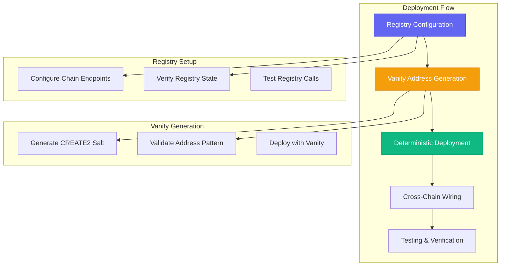

# Production Deployment Guide

Complete guide for deploying Eagle Vault's omnichain infrastructure with registry-based deterministic addressing.

## Prerequisites

<div class="animate-fade-in-up">

:::tip **Environment Setup**
Ensure you have the required tools and configurations before beginning deployment.
:::

</div>

### Required Tools

```bash
# Node.js and package management
node --version    # v18+
npm --version     # v8+

# Hardhat development environment
npx hardhat --version

# Rust for vanity generation
cargo --version
```

### Environment Configuration

```bash
# .env file configuration
DEPLOYER_PRIVATE_KEY=0x...                    # Deployment wallet
ETHERSCAN_API_KEY=your_etherscan_key         # Contract verification

# Real token addresses (no minting policy)
WLFI_ETHEREUM=0x...                          # Existing WLFI on Ethereum  
USD1_ETHEREUM=0x...                          # Existing USD1 on Ethereum
WLFI_BSC=0x...                               # Existing WLFI on BSC
USD1_BSC=0x...                               # Existing USD1 on BSC

# Registry configuration
CHAIN_REGISTRY=0x472656c76f45e8a8a63fffd32ab5888898eea91e
CREATE2_FACTORY=0x695d6B3628B4701E7eAfC0bc511CbAF23f6003eE
TARGET_VANITY_PATTERN=47ea91e               # Target address suffix
```

## Deployment Architecture

### Registry-First Approach

The deployment follows a registry-based pattern enabling deterministic addresses:



## Phase 1: Registry Configuration

### Configure Chain Registry

```bash
# Configure BSC in the universal registry
npx hardhat run scripts/configure-real-registry.ts --network bsc

# Verify registry configuration
npx hardhat run scripts/check-registry.ts --network bsc
```

### Registry Configuration Script

```typescript
// scripts/configure-real-registry.ts
import { ethers } from "hardhat";

async function configureRegistry() {
    const registry = await ethers.getContractAt(
        "IChainRegistry", 
        "0x472656c76f45e8a8a63fffd32ab5888898eea91e"
    );
    
    // Configure LayerZero endpoints for each chain
    const chainConfigs = [
        { chainId: 1, eid: 30101, endpoint: "0x1a44076050125825900e736c501f859c50fE728c" },
        { chainId: 56, eid: 30102, endpoint: "0x1a44076050125825900e736c501f859c50fE728c" },
        { chainId: 42161, eid: 30110, endpoint: "0x1a44076050125825900e736c501f859c50fE728c" },
        { chainId: 8453, eid: 30184, endpoint: "0x1a44076050125825900e736c501f859c50fE728c" },
        { chainId: 43114, eid: 30106, endpoint: "0x1a44076050125825900e736c501f859c50fE728c" }
    ];
    
    for (const config of chainConfigs) {
        await registry.setChainConfig(config.chainId, {
            layerZeroEid: config.eid,
            endpoint: config.endpoint,
            isActive: true
        });
        
        console.log(`✅ Configured chain ${config.chainId} with EID ${config.eid}`);
    }
}
```

### Registry Verification

```bash
# Check registry state
npx hardhat verify-registry --network bsc

# Expected output:
# ✅ Registry: 0x472656c76f45e8a8a63fffd32ab5888898eea91e
# ✅ BSC Config: EID 30102, Endpoint 0x1a44076050125825900e736c501f859c50fE728c
# ✅ Registry Owner: 0x... (your deployer address)
```

## Phase 2: Vanity Address Generation

### Generate Vanity Address

<div class="animate-fade-in-up">

:::note **Performance Metrics**
Current vanity generation achieving ~437,000 attempts/second targeting `0x47...EA91E` pattern.
:::

</div>

```bash
# Calculate bytecode hash for EagleShareOFT
npx hardhat run scripts/calculate-current-eagle-bytecode-hash.ts

# Start vanity generation (Rust-based)
cd vanity-generator
cargo run <bytecode_hash> 0x695d6B3628B4701E7eAfC0bc511CbAF23f6003eE 47 ea91e

# Monitor progress
# Attempts: 220,000,000+ processed
# Speed: ~437k attempts/second  
# Target: 0x47...EA91E (7 hex chars = ~268M possibilities)
```

### Vanity Generation Code

```rust
// vanity-generator/src/main.rs
use ethers::core::k256::ecdsa::SigningKey;
use ethers::core::utils::{hex, keccak256};
use std::time::Instant;

fn main() {
    let factory_address = "0x695d6B3628B4701E7eAfC0bc511CbAF23f6003eE";
    let bytecode_hash = std::env::args().nth(1).expect("Bytecode hash required");
    let target_suffix = "ea91e";
    let target_prefix = "47";
    
    let start_time = Instant::now();
    let mut attempts = 0u64;
    
    loop {
        let salt = generate_random_salt();
        let computed_address = compute_create2_address(
            factory_address, 
            &salt, 
            &bytecode_hash
        );
        
        if address_matches_pattern(&computed_address, target_prefix, target_suffix) {
            println!("Found vanity address!");
            println!("Address: {}", computed_address);
            println!("Salt: 0x{}", hex::encode(salt));
            println!("Attempts: {}", attempts);
            break;
        }
        
        attempts += 1;
        if attempts % 100_000 == 0 {
            let elapsed = start_time.elapsed().as_secs();
            let rate = attempts / elapsed.max(1);
            println!("Attempts: {} | Rate: {}/sec", attempts, rate);
        }
    }
}
```

## Phase 3: Contract Deployment

### Deploy Production Contracts

```bash
# Deploy contracts with vanity address and real token addresses
npx hardhat run scripts/deploy-production-contracts.ts --network bsc

# Deploy to additional networks
npx hardhat run scripts/deploy-production-contracts.ts --network ethereum
npx hardhat run scripts/deploy-production-contracts.ts --network arbitrum
```

### Production Deployment Script

```typescript
// scripts/deploy-production-contracts.ts
import { ethers } from "hardhat";

async function deployProduction() {
    const [deployer] = await ethers.getSigners();
    console.log("Deploying with account:", deployer.address);
    
    // Load environment configuration
    const registryAddress = process.env.CHAIN_REGISTRY!;
    const create2Factory = process.env.CREATE2_FACTORY!;
    const vanityYAML = process.env.VANITY_SALT!; // From vanity generation
    
    // Get real token addresses (no minting)
    const wlfiAddress = process.env[`WLFI_${network.name.toUpperCase()}`]!;
    const usd1Address = process.env[`USD1_${network.name.toUpperCase()}`]!;
    
    console.log(`Using WLFI: ${wlfiAddress}`);
    console.log(`Using USD1: ${usd1Address}`);
    
    // Deploy EagleShareOFT with vanity address
    const shareOFTFactory = await ethers.getContractFactory("EagleShareOFT");
    const shareOFTBytecode = shareOFTFactory.bytecode;
    const constructorArgs = ethers.utils.defaultAbiCoder.encode(
        ["address"], 
        [registryAddress]
    );
    
    const create2 = await ethers.getContractAt("ICREATE2Factory", create2Factory);
    const shareOFTAddress = await create2.deploy(
        vanityYAML, 
        shareOFTBytecode + constructorArgs.slice(2)
    );
    
    console.log(`✅ EagleShareOFT deployed: ${shareOFTAddress}`);
    
    // Deploy WLFI Adapter (wraps existing tokens)
    const wlfiAdapter = await ethers.deployContract("WLFIAdapter", [
        wlfiAddress,    // Existing WLFI token
        registryAddress,
        deployer.address
    ]);
    
    console.log(`✅ WLFI Adapter deployed: ${wlfiAdapter.address}`);
    
    // Deploy USD1 Adapter (wraps existing tokens)  
    const usd1Adapter = await ethers.deployContract("USD1Adapter", [
        usd1Address,    // Existing USD1 token
        registryAddress,
        deployer.address
    ]);
    
    console.log(`✅ USD1 Adapter deployed: ${usd1Adapter.address}`);
    
    // Save deployment addresses
    const deployment = {
        network: network.name,
        shareOFT: shareOFTAddress,
        wlfiAdapter: wlfiAdapter.address,
        usd1Adapter: usd1Adapter.address,
        timestamp: new Date().toISOString()
    };
    
    console.log("Deployment complete:", deployment);
}
```

## Phase 4: Cross-Chain Configuration

### Configure LayerZero Peers

```typescript
// Configure trusted remotes between chains
async function configurePeers() {
    const shareOFT = await ethers.getContractAt("EagleShareOFT", shareOFTAddress);
    
    // Set trusted remotes for all supported chains
    const peerConfigs = [
        { eid: 30101, address: ethereumAddress },  // Ethereum
        { eid: 30102, address: bscAddress },       // BSC  
        { eid: 30110, address: arbitrumAddress },  // Arbitrum
        { eid: 30184, address: baseAddress },      // Base
        { eid: 30106, address: avalancheAddress }  // Avalanche
    ];
    
    for (const peer of peerConfigs) {
        if (peer.eid !== currentChainEid) {
            await shareOFT.setPeer(peer.eid, peer.address);
            console.log(`✅ Set peer ${peer.eid}: ${peer.address}`);
        }
    }
}
```

### Enable Cross-Chain Operations

```bash
# Enable cross-chain transfers
npx hardhat enable-cross-chain --network bsc
npx hardhat enable-cross-chain --network ethereum

# Test cross-chain messaging
npx hardhat test-cross-chain --from bsc --to ethereum --amount 100
```

## Phase 5: Security Configuration

### Configure Access Controls

```typescript
// Set up role-based access control
async function configureSecurity() {
    const shareOFT = await ethers.getContractAt("EagleShareOFT", shareOFTAddress);
    
    // Configure administrators
    await shareOFT.grantRole(ADMIN_ROLE, adminAddress);
    await shareOFT.grantRole(MANAGER_ROLE, managerAddress);
    
    // Set emergency controls
    await shareOFT.setEmergencyPause(false); // Initially not paused
    await shareOFT.setEmergencyContacts([emergencyAddress1, emergencyAddress2]);
    
    console.log("✅ Security configuration complete");
}
```

### Enable Emergency Procedures

```solidity
// Emergency pause functionality
function emergencyPause(string memory reason) external onlyRole(ADMIN_ROLE) {
    _pause();
    emit EmergencyPause(msg.sender, reason);
}

// Emergency asset recovery
function emergencyRecover(address token, address to) external onlyRole(ADMIN_ROLE) {
    require(paused(), "Emergency recovery only when paused");
    IERC20(token).transfer(to, IERC20(token).balanceOf(address(this)));
}
```

## Verification and Testing

### Contract Verification

```bash
# Verify contracts on Etherscan/BSCScan
npx hardhat verify --network bsc 0x... "constructor_arg1" "constructor_arg2"

# Verify registry integration
npx hardhat verify-registry-integration --network bsc
```

### Integration Testing

```typescript
// Test cross-chain deposit flow
describe("Cross-Chain Integration", function() {
    it("should handle cross-chain deposit", async function() {
        // Test BSC -> Ethereum deposit
        const tx = await wlfiAdapter.deposit(
            ethers.utils.parseEther("100"),
            30101, // Ethereum EID
            ethers.constants.AddressZero,
            "0x" // options
        );
        
        expect(tx).to.emit(wlfiAdapter, "CrossChainDeposit");
    });
    
    it("should maintain vault accounting", async function() {
        const totalAssetsBefore = await vault.totalAssets();
        
        // Perform cross-chain operation
        await performCrossChainDeposit();
        
        const totalAssetsAfter = await vault.totalAssets();
        expect(totalAssetsAfter).to.be.gt(totalAssetsBefore);
    });
});
```

## Production Checklist

### Pre-Launch Verification

<div class="animate-fade-in-up">

- [ ] **Registry Configuration**
  - [ ] All chain endpoints configured
  - [ ] Registry ownership transferred
  - [ ] Registry state verified

- [ ] **Vanity Address Generation**
  - [ ] Target pattern achieved: `0x47...EA91E`
  - [ ] Salt recorded securely
  - [ ] Address verified on all chains

- [ ] **Contract Deployment**
  - [ ] All contracts deployed with vanity addresses
  - [ ] Real token addresses configured (no minting)
  - [ ] Constructor arguments verified

- [ ] **Cross-Chain Configuration**
  - [ ] Peer addresses set on all chains
  - [ ] LayerZero messaging tested
  - [ ] Gas limits configured

- [ ] **Security Setup**
  - [ ] Access controls configured
  - [ ] Emergency procedures tested
  - [ ] Multi-sig setup complete

- [ ] **Integration Testing**
  - [ ] Cross-chain deposits tested
  - [ ] Cross-chain withdrawals tested
  - [ ] Edge cases validated
  - [ ] Gas estimation verified

</div>

### Launch Sequence

```bash
# 1. Final verification
npx hardhat run scripts/final-verification.ts

# 2. Enable public access
npx hardhat enable-public-access --network ethereum --network bsc

# 3. Monitor deployment
npx hardhat monitor-health --all-networks

# 4. Announce launch
echo "Eagle Vault omnichain infrastructure is live!"
```

## Monitoring and Maintenance

### Health Monitoring

```typescript
// Automated health checks
async function monitorSystemHealth() {
    const healthChecks = [
        checkRegistryHealth(),
        checkCrossChainConnectivity(),
        checkVaultAccounting(),
        checkLiquidityPositions(),
        checkEmergencyControls()
    ];
    
    const results = await Promise.all(healthChecks);
    const overallHealth = results.every(check => check.healthy);
    
    if (!overallHealth) {
        await alertAdministrators(results);
    }
    
    return {
        timestamp: Date.now(),
        healthy: overallHealth,
        details: results
    };
}
```

### Upgrade Procedures

```bash
# Registry-based upgrades
npx hardhat upgrade-via-registry --component shareOFT --network all

# Generate new vanity address for upgrades
cargo run new_bytecode_hash 0x695d6B3628B4701E7eAfC0bc511CbAF23f6003eE 47 ea91e

# Deploy upgrade with deterministic addressing
npx hardhat deploy-upgrade --salt new_vanity_salt --network ethereum
```

---

**This deployment guide ensures a robust, secure launch of Eagle Vault's omnichain infrastructure with deterministic addressing and comprehensive monitoring.**
