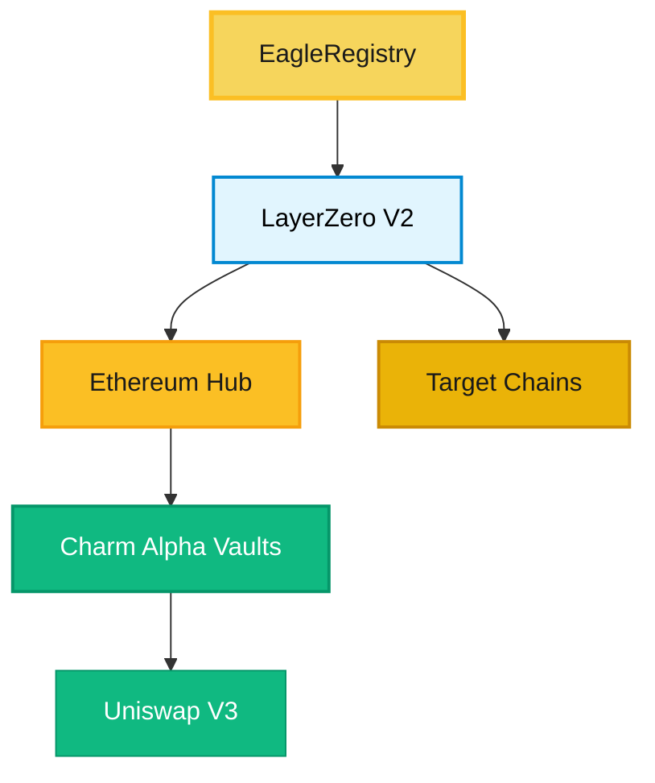

# Developer Documentation

**Build with Eagle Omnichain Vault.** Integrate LayerZero V2 powered cross-chain infrastructure and leverage our ERC-4626 compatible vault system.

## For Developers

Eagle OVault provides a comprehensive suite of smart contracts and integrations for building omnichain DeFi applications.

### Technical Stack
- **LayerZero V2**: Native omnichain messaging infrastructure
- **ERC-4626**: Standard vault interface for universal compatibility
- **Charm Finance**: Alpha Vault strategies for Uniswap V3
- **CREATE2 Factory**: Deterministic cross-chain deployment

### Documentation Sections
1. **[Architecture Overview](/dev/architecture)** - System design and components
2. **[Quick Start Guide](/dev/quick-start)** - Get started in 10 minutes
3. **[Smart Contracts](/contracts/eagle-ovault)** - Contract interfaces and ABIs
4. **[Deployment Guide](/dev/deployment-protected)** - Deploy across chains (Team Access Required)

---

## System Architecture

Our omnichain vault system uses a registry-based architecture for deterministic cross-chain deployment:



---

## Deployed Infrastructure

### Core Contracts (Live)

| Contract | Address | Purpose |
|----------|---------|---------|
| **EagleRegistry** | `0x472656c76f45e8a8a63fffd32ab5888898eea91e` | LayerZero endpoint configuration |
| **CREATE2 Factory** | `0x695d6B3628B4701E7eAfC0bc511CbAF23f6003eE` | Deterministic deployment |

### Development Status

- **Phase 1**: Foundation infrastructure (Completed ✓)
- **Phase 2**: Ethereum hub deployment (In Progress)
- **Phase 3**: Multi-chain spoke deployment (Planned)

---

## Smart Contract Categories

### Adapters (`contracts/layerzero-ovault/adapters/`)

Enable cross-chain functionality for existing ERC20 tokens without minting new supply:

```solidity
// Wraps existing tokens for omnichain transfer
contract WLFIAdapter is OFTAdapter {
    // No minting - only wraps existing tokens
}
```

**Purpose**: Cross-chain token transfers  
**Chains**: Ethereum, BNB Chain (where tokens exist)

### OFTs (`contracts/layerzero-ovault/oft/`)

Native omnichain tokens with registry integration:

```solidity
// Registry-integrated vault shares
contract EagleShareOFT is OFT {
    IChainRegistry public immutable registry;
    // Uses registry for LayerZero endpoint discovery
}
```

**Purpose**: Vault share tokens  
**Deployment**: Deterministic addresses across all chains

### Composers (`contracts/layerzero-ovault/composers/`)

Advanced cross-chain operations and composability:

```solidity
// Complex cross-chain interactions
contract EagleOVaultComposer {
    // Multi-step cross-chain operations
}
```

---

## Integration Quick Start

### Install Dependencies

```bash
npm install @layerzerolabs/lz-evm-sdk-v2
npm install @openzeppelin/contracts
```

### Basic Vault Integration

```solidity
import {IERC4626} from "@openzeppelin/contracts/interfaces/IERC4626.sol";

contract YourProtocol {
    IERC4626 public vault = IERC4626(VAULT_ADDRESS);
    
    function depositToVault(uint256 amount) external {
        // Standard ERC-4626 deposit
        vault.deposit(amount, msg.sender);
    }
    
    function withdrawFromVault(uint256 shares) external {
        // Standard ERC-4626 withdrawal
        vault.redeem(shares, msg.sender, msg.sender);
    }
}
```

### Cross-Chain Operations

```solidity
import {ILayerZeroEndpointV2} from "@layerzerolabs/lz-evm-protocol-v2/contracts/interfaces/ILayerZeroEndpointV2.sol";
import {IChainRegistry} from "./interfaces/IChainRegistry.sol";

contract CrossChainVault {
    IChainRegistry public registry;
    
    constructor(address _registry) {
        registry = IChainRegistry(_registry);
    }
    
    function getEndpoint(uint32 chainId) public view returns (address) {
        return registry.getLayerZeroEndpoint(chainId);
    }
}
```

---

## Developer Resources

<div className="dev-resources-grid">
  <div className="resource-card">
    <h3>Architecture</h3>
    <p>Deep dive into the Eagle OVault system design and components.</p>
    <a href="/dev/architecture" className="resource-link">Explore Architecture →</a>
  </div>
  
  <div className="resource-card">
    <h3>Quick Start</h3>
    <p>Deploy and test Eagle OVault in 10 minutes.</p>
    <a href="/dev/quick-start" className="resource-link">Get Started →</a>
  </div>
  
  <div className="resource-card">
    <h3>Smart Contracts</h3>
    <p>Contract interfaces, ABIs, and detailed documentation.</p>
    <a href="/contracts/eagle-ovault" className="resource-link">View Contracts →</a>
  </div>
  
  <div className="resource-card">
    <h3>GitHub</h3>
    <p>Explore open source code and contribute to development.</p>
    <a href="https://github.com/47-Eagle" className="resource-link">Browse Code →</a>
  </div>
</div>

---

## Key Integration Patterns

### 1. Standard Vault Operations
All vaults implement ERC-4626 for universal compatibility

### 2. Registry-Based Configuration
Use `IChainRegistry` for LayerZero endpoint discovery

### 3. Deterministic Deployment
CREATE2 factory ensures consistent addresses across chains

### 4. No Token Minting
Adapters wrap existing tokens, OFTs are for new assets only

---

## Development Community

- **GitHub**: [47-Eagle Organization](https://github.com/47-Eagle) - Open source repositories
- **Documentation**: Comprehensive technical guides and examples
- **Smart Contracts**: Fully audited and open source

---

*Building the future of omnichain DeFi with LayerZero V2. Join us in creating seamless cross-chain experiences.*