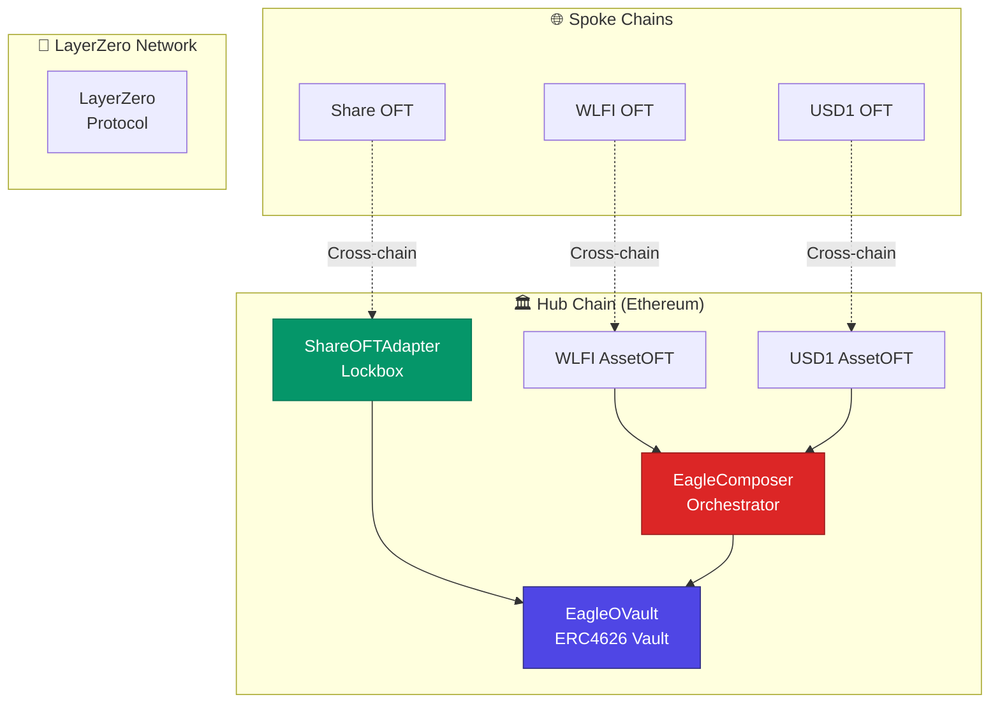

# Eagle Omnichain Vault - Developer Overview

Welcome to the **Eagle Omnichain Vault** developer documentation! This is a **clean, standards-compliant** implementation using LayerZero's official OVault pattern.

## What is Eagle Vault?

The Eagle Omnichain Vault is a next-generation DeFi infrastructure that enables:

- **Omnichain Operations**: Seamless cross-chain deposits and withdrawals
- **Dual-Token Strategy**: WLFI + USD1 Uniswap V3 LP management
- **Enterprise Security**: Production-ready security features and access controls
- **Gas Optimized**: Efficient cross-chain messaging and batch operations
- **Vanity Addresses**: Elegant `0x47...EA91E` address pattern

## Architecture at a Glance



## 🚀 **Key Features**

### **Standards Compliance**
- ✅ **ERC4626**: Tokenized Vault Standard
- ✅ **LayerZero OVault**: Official omnichain vault pattern
- ✅ **ERC20**: Fungible token standard for assets
- ✅ **AccessControl**: Role-based permissions

### **Security Features**
- 🔒 **Reentrancy Protection**: NonReentrant modifiers on all external functions
- 🛡️ **Input Validation**: Comprehensive zero-address and amount checks
- ⚖️ **Slippage Protection**: TWAP-based price validation with configurable limits
- 🎯 **Access Control**: Multi-tier permission system

### **Cross-Chain Capabilities**
- 🌐 **5 Supported Chains**: Ethereum (hub) + BSC, Arbitrum, Base, Avalanche (spokes)
- ⚡ **Instant Transfers**: Sub-minute cross-chain operations
- 💰 **Asset Bridging**: Seamless WLFI and USD1 transfers
- 📜 **Share Distribution**: Cross-chain vault share management

## 📋 **Contract Architecture**

### **Hub Chain Contracts (Ethereum)**

| Contract | Purpose | Standard |
|----------|---------|----------|
| **EagleOVault** | Main vault managing LP strategy | ERC4626 |
| **ShareOFTAdapter** | Cross-chain share lockbox | LayerZero OFTAdapter |
| **EagleComposer** | Cross-chain operation orchestrator | LayerZero Composer |
| **WLFIAssetOFT** | WLFI token hub | LayerZero OFT |
| **USD1AssetOFT** | USD1 token hub | LayerZero OFT |

### **Spoke Chain Contracts**

| Contract | Purpose | Chains |
|----------|---------|--------|
| **ShareOFT** | Vault share representation | BSC, Arbitrum, Base, Avalanche |
| **WLFIAssetOFT** | WLFI token spoke | BSC, Arbitrum, Base, Avalanche |
| **USD1AssetOFT** | USD1 token spoke | BSC, Arbitrum, Base, Avalanche |

## 🔄 **Operation Flows**

### **Cross-Chain Deposit**
```
User (BSC) → WLFI OFT → LayerZero → Ethereum → Composer → Vault → Mint Shares → LayerZero → User (BSC)
```

### **Cross-Chain Withdrawal**
```
User (Base) → Share OFT → LayerZero → Ethereum → Adapter → Vault → Redeem Assets → LayerZero → User (Base)
```

## 🛠️ **Development Stack**

- **Framework**: Hardhat with TypeScript
- **Testing**: Chai + Waffle + Mocha
- **Deployment**: Custom Hardhat tasks with vanity address support
- **Security**: Slither static analysis + comprehensive test suite
- **Networks**: Multi-chain deployment configuration

## 📊 **Supported Networks**

| Network | Chain ID | LayerZero EID | Status |
|---------|----------|---------------|--------|
| Ethereum | 1 | 30101 | 🏛️ Hub |
| BSC | 56 | 30102 | 🌐 Spoke |
| Arbitrum | 42161 | 30110 | 🌐 Spoke |
| Base | 8453 | 30184 | 🌐 Spoke |
| Avalanche | 43114 | 30106 | 🌐 Spoke |

## 🎯 **Next Steps**

Ready to dive deeper? Here are your next steps:

1. **⚡ [Quick Start](./quick-start)** - Get up and running in 10 minutes
2. **🏗️ [Architecture](./architecture)** - Deep dive into system design
3. **🚀 [Deployment](./deployment)** - Deploy your own Eagle Vault
4. **📚 [API Reference](../api/overview)** - Complete API documentation

---

**Built with ❤️ using LayerZero OVault Standard**

