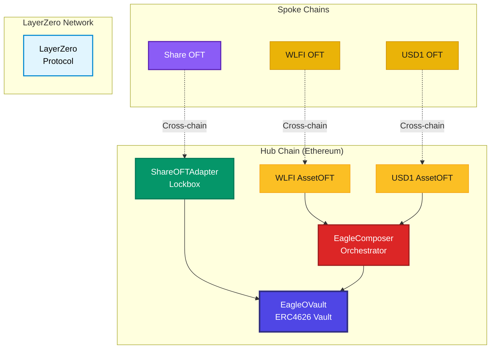

# Developer Overview

## Comprehensive Development Guide

Welcome to the **Eagle Omnichain Vault** developer documentation! This is a **clean, standards-compliant** implementation using LayerZero's official OVault pattern, designed for institutional-grade DeFi applications.

## What makes Eagle development unique?

**Standards-First Architecture**  
Built on proven ERC4626 and LayerZero OVault standards, ensuring compatibility and reliability.

**Enterprise Security**  
Production-ready security features including reentrancy protection, access control, and slippage validation.

**True Cross-Chain**  
Deploy once on Ethereum, interact from any of 5 supported chains with seamless user experience.

## Architecture at a Glance



## Key Features

### **Standards Compliance**
-  **ERC4626**: Tokenized Vault Standard
-  **LayerZero OVault**: Official omnichain vault pattern
-  **ERC20**: Fungible token standard for assets
-  **AccessControl**: Role-based permissions

### **Security Features**
-  **Reentrancy Protection**: NonReentrant modifiers on all external functions
- **Input Validation**: Comprehensive zero-address and amount checks
- **Slippage Protection**: TWAP-based price validation with configurable limits
- **Access Control**: Multi-tier permission system

### **Cross-Chain Capabilities**
- **5 Supported Chains**: Ethereum (hub) + BSC, Arbitrum, Base, Avalanche (spokes)
- **Instant Transfers**: Sub-minute cross-chain operations
- **Asset Bridging**: Seamless WLFI and USD1 transfers
- 📜 **Share Distribution**: Cross-chain vault share management

## Contract Architecture

### **Hub Chain Contracts (Ethereum)**

| Contract | Purpose | Standard |
|----------|---------|----------|
| **EagleOVault** | Main vault managing LP strategy | ERC4626 |
| **ShareOFTAdapter** | Cross-chain share lockbox | LayerZero OFTAdapter |
| **EagleComposer** | Cross-chain operation orchestrator | LayerZero Composer |
| **WLFIAssetOFT** | WLFI token hub | LayerZero OFT |
| **USD1AssetOFT** | USD1 token hub | LayerZero OFT |

### **Spoke Chain Contracts**

| Contract | Purpose | Chains |
|----------|---------|--------|
| **ShareOFT** | Vault share representation | BSC, Arbitrum, Base, Avalanche |
| **WLFIAssetOFT** | WLFI token spoke | BSC, Arbitrum, Base, Avalanche |
| **USD1AssetOFT** | USD1 token spoke | BSC, Arbitrum, Base, Avalanche |

##  **Operation Flows**

### **Cross-Chain Deposit**
```
User (BSC) → WLFI OFT → LayerZero → Ethereum → Composer → Vault → Mint Shares → LayerZero → User (BSC)
```

### **Cross-Chain Withdrawal**
```
User (Base) → Share OFT → LayerZero → Ethereum → Adapter → Vault → Redeem Assets → LayerZero → User (Base)
```

## Development Stack

| Component                              | Technology                                                   |
| -------------------------------------- | ------------------------------------------------------------ |
| Framework                           | [Hardhat with TypeScript for robust development](./quick-start) |
| 🧪 Testing                            | [Comprehensive Chai + Waffle test suite](./quick-start)                        |
| Deployment                         | [Custom Hardhat tasks with vanity address support](./architecture)                       |
| Security                           | [Slither analysis + production-grade patterns](./architecture)                              |

## Supported Networks

| Network   | Chain ID | LayerZero EID | Role        | Status |
|-----------|----------|---------------|-------------|--------|
| Ethereum  | 1        | 30101         | Hub      | Live   |
| BSC       | 56       | 30102         | Spoke    | Live   |
| Arbitrum  | 42161    | 30110         | Spoke    | Live   |
| Base      | 8453     | 30184         | Spoke    | Live   |
| Avalanche | 43114    | 30106         | Spoke    | Live   |

## Core Features

-  **ERC4626 Compliance**: Standard tokenized vault interface
-  **LayerZero Integration**: Official OVault pattern implementation  
-  **Multi-Chain Support**: 5 networks with seamless UX
-  **Enterprise Security**: Production-ready security features
-  **Gas Optimization**: Efficient cross-chain operations
-  **Vanity Addresses**: Elegant `0x47...EA91E` pattern

## Get Started

Ready to build with Eagle Vault? Choose your path:

- **[Quick Start](./quick-start)** - Deploy in 10 minutes
- **[Architecture Guide](./architecture)** - Deep system understanding  
- **[API Reference](../api/overview)** - Complete function documentation
- **[Smart Contracts](../contracts/eagle-ovault)** - Contract specifications

---

**Built with LayerZero OVault Standard**

