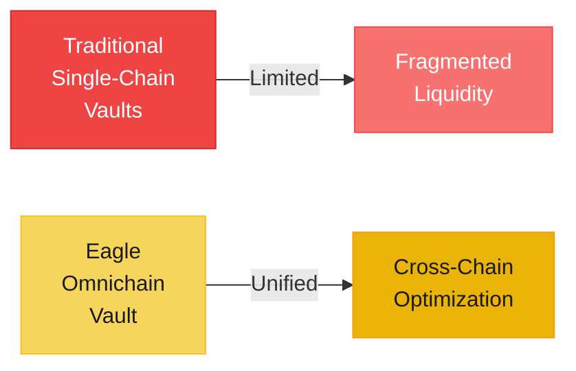
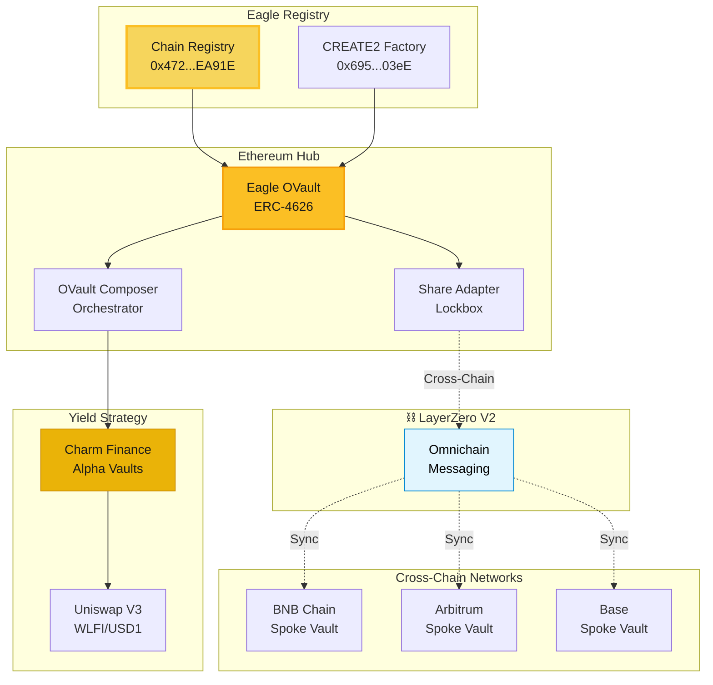
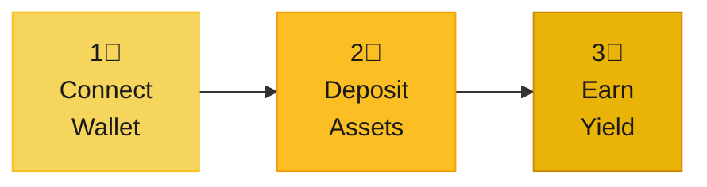
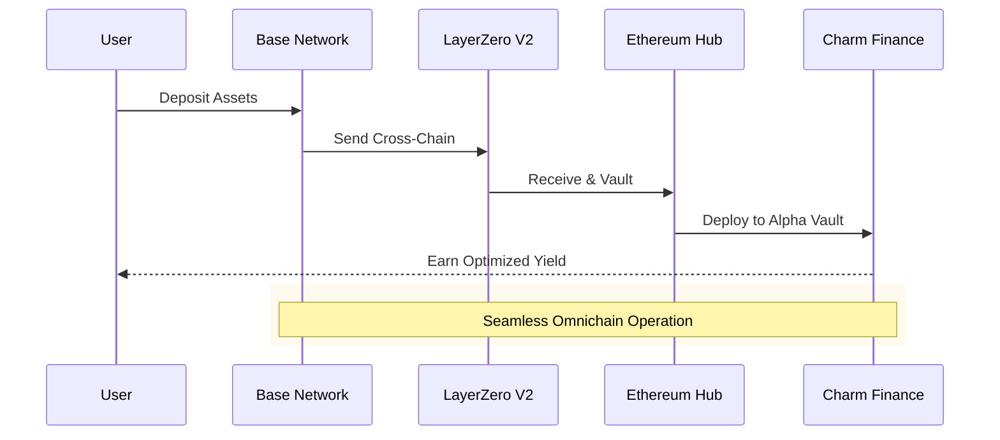
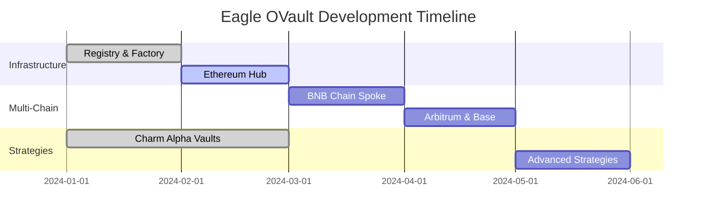

# Eagle Omnichain Vault

**Seamless cross-chain DeFi powered by LayerZero V2**

Eagle OVault delivers institutional-grade yield optimization across multiple blockchains with automated Uniswap V3 strategies through Charm Finance Alpha Vaults.

---

## What Makes Eagle Different

### Core Innovation
- **True Omnichain**: Native LayerZero V2 integration, not bridges
- **Automated Strategies**: Charm Finance Alpha Vaults for Uniswap V3
- **Deterministic Deployment**: Same addresses across all chains
- **ERC-4626 Standard**: Universal vault compatibility

---

## Choose Your Path

  

    <h3>Users</h3>
    
Access cross-chain yield optimization with institutional-grade security and automated strategies.

    <a href="/user" className="resource-link">Explore User Docs →</a>
  

  
  

    <h3>Developers</h3>
    
Build with LayerZero V2, ERC-4626 vaults, and comprehensive smart contract integrations.

    <a href="/dev" className="resource-link">Developer Docs →</a>
  

  
  

    <h3>Investors</h3>
    
Discover the opportunity in next-generation omnichain DeFi infrastructure and technology.

    <a href="/investor" className="resource-link">Investor Relations →</a>
  

  
  

    <h3>Partners</h3>
    
Join our ecosystem of strategic partners building the future of cross-chain DeFi together.

    <a href="/partner" className="resource-link">Partnership Hub →</a>
  

---

## System Architecture

Our registry-based omnichain architecture enables seamless multi-chain operations:

---

## How It Works

### For Users: Simple 3-Step Process

1. **Connect**: Link your Web3 wallet to Eagle OVault
2. **Deposit**: Add WLFI/USD1 on any supported chain
3. **Earn**: Automated Charm Finance strategies optimize your yield

### Cross-Chain Flow

---

## Current Deployment

### Live Infrastructure

| Component | Status | Address |
|-----------|--------|---------|
| **Eagle Registry** |  Live | `0x472656c76f45e8a8a63fffd32ab5888898eea91e` |
| **CREATE2 Factory** |  Live | `0x695d6B3628B4701E7eAfC0bc511CbAF23f6003eE` |
| **Ethereum Hub** |  In Progress | Target: `0x47...EA91E` |
| **Charm Integration** |  Active | WLFI/USD1 Strategies |

### Development Roadmap

---

## Why Eagle OVault

### Technical Excellence
- **LayerZero V2**: Battle-tested omnichain messaging
- **ERC-4626**: Industry-standard vault interface
- **Open Source**: Fully transparent and auditable code
- **Deterministic**: Consistent addresses across all chains

### Strategic Integration
- **Charm Finance**: Proven Uniswap V3 optimization
- **Automated Rebalancing**: AI-driven position management
- **Multi-Pool**: Risk-optimized diversification

### Security First
- **Registry-Based**: Centralized configuration management
- **No Arbitrary Minting**: Respects token economics
- **Audited Contracts**: Security-focused development
- **Multi-Signature**: Governance-controlled operations

---

## Get Started

### For Users
Start earning cross-chain yield with automated strategies  
→ **[User Quick Start Guide](/user/getting-started)**

### For Developers
Integrate Eagle OVault into your application  
→ **[Developer Quick Start](/dev/quick-start)**

### For Institutions
Explore partnerships and integration opportunities  
→ **[Contact Partnerships](/partner)**

---

## Community & Resources

- **GitHub**: [47-Eagle Organization](https://github.com/47-Eagle)
- **Documentation**: Comprehensive guides for all audiences
- **Open Source**: Transparent development and operations

---

*Building the future of omnichain DeFi with LayerZero V2 and Charm Finance. Experience seamless cross-chain yield optimization today.*