# Eagle Omnichain Vault

**Seamless cross-chain DeFi powered by LayerZero V2**

Eagle OVault delivers institutional-grade yield optimization across multiple blockchains with automated Uniswap V3 strategies through Charm Finance Alpha Vaults.

---

## Current Architecture

### Core Innovation
- **Multi-Domain Deployment**: Separate landing page, app, and docs
- **True Omnichain**: Native LayerZero V2 integration
- **Automated Strategies**: Charm Finance Alpha Vaults for Uniswap V3
- **Modern Stack**: React, TypeScript, Tailwind CSS

---

## Live Deployments

### 🌐 **Production URLs**
- **[47eagle.com](https://47eagle.com)** - Marketing landing page (GitHub Pages)
- **[app.47eagle.com](https://app.47eagle.com)** - DeFi application (Vercel)
- **[docs.47eagle.com](https://docs.47eagle.com)** - Documentation (GitHub Pages)

### 🏗️ **Deployment Architecture**

| Component | Technology | Repository | Status |
|-----------|------------|------------|--------|
| Landing Page | React + Vite | `47-eagle/landing-page` | ✅ Deployed |
| DeFi App | React + Vite | `47-eagle/v1` | ✅ Deployed |
| Documentation | Docusaurus | `47-eagle/docs` | ✅ Deployed |
| Smart Contracts | Solidity + Foundry | `wenakita/EagleOVaultV2` | ✅ Deployed |

### 📋 **Ethereum Mainnet Deployments**

#### **Core Protocol Contracts**
| Contract | Address | Status |
|----------|---------|--------|
| **Eagle Vault** | `0x47b3ef629D9cB8DFcF8A6c61058338f4e99d7953` | ✅ Live |
| **Eagle Share OFT** | `0x474eD38C256A7FA0f3B8c48496CE1102ab0eA91E` | ✅ Live |
| **Eagle Vault Wrapper** | `0x47dAc5063c526dBc6f157093DD1D62d9DE8891c5` | ✅ Live |
| **Eagle Registry** | `0x47c81c9a70CA7518d3b911bC8C8b11000e92F59e` | ✅ Live |

#### **Strategy Contracts**
| Contract | Address | Status |
|----------|---------|--------|
| **Charm USD1/WLFI Strategy** | `0x47B2659747d6A7E00c8251c3C3f7e92625a8cf6f` | ✅ Live |
| **Charm WETH/WLFI Strategy** | `0x5c525Af4153B1c43f9C06c31D32a84637c617FfE` | ✅ Live |

#### **External Protocol Contracts**
| Contract | Address | Protocol |
|----------|---------|----------|
| **Charm USD1/WLFI Vault** | `0x22828Dbf15f5FBa2394Ba7Cf8fA9A96BdB444B71` | Charm Finance |
| **Charm WETH/WLFI Vault** | `0x3314e248F3F752Cd16939773D83bEb3a362F0AEF` | Charm Finance |

#### **Infrastructure Contracts**
| Contract | Address | Purpose |
|----------|---------|---------|
| **CREATE2 Factory** | `0x4e59b44847b379578588920ca78fbf26c0b4956c` | Deterministic Deployment |
| **OVault Composer** | `0x3A91B3e863C0bd6948088e8A0A9B1D22d6D05da9` | Cross-chain Composition |

#### **Token Contracts**
| Token | Address | Symbol |
|-------|---------|--------|
| **WLFI** | `0xdA5e1988097297dCdc1f90D4dFE7909e847CBeF6` | WLFI |
| **USD1** | `0x8d0D000Ee44948FC98c9B98A4FA4921476f08B0d` | USD1 |
| **WETH** | `0xC02aaA39b223FE8D0A0e5C4F27eAD9083C756Cc2` | WETH |

#### **Uniswap V3 Pools**
| Pool | Address | Fee Tier |
|------|---------|----------|
| **WLFI/USD1 (1%)** | `0xf9f5E6f7A44Ee10c72E67Bded6654afAf4D0c85d` | 1.00% |
| **WLFI/USD1 (0.3%)** | `0x4637ea6ecf7e16c99e67e941ab4d7d52eac7c73d` | 0.30% |
| **WETH/WLFI (1%)** | `0xCa2e972f081764c30Ae5F012A29D5277EEf33838` | 1.00% |
| **WETH/WLFI (0.3%)** | `0xcdf9f50519eb0a9995730ddb6e7d3a8b1d8ffa07` | 0.30% |

### 🔗 **Repository Links**
- **Main Repository**: https://github.com/wenakita/EagleOVaultV2
- **Landing Page**: https://github.com/47-Eagle/landing-page
- **Documentation**: https://github.com/47-Eagle/docs

### 📋 **Deployment Checklist**

#### ✅ **Landing Page (47eagle.com)**
- [x] Repository: `47-eagle/landing-page`
- [x] Platform: GitHub Pages
- [x] Domain: 47eagle.com
- [x] Status: Live
- [x] "Launch App" button redirects to app.47eagle.com

#### ✅ **DeFi Application (app.47eagle.com)**
- [x] Repository: `wenakita/EagleOVaultV2/frontend`
- [x] Platform: Vercel
- [x] Domain: app.47eagle.com
- [x] Status: Live
- [x] Full DeFi functionality with wallet integration

#### ✅ **Documentation (docs.47eagle.com)**
- [x] Repository: `47-eagle/docs`
- [x] Platform: GitHub Pages
- [x] Domain: docs.47eagle.com
- [x] Status: Live
- [x] Docusaurus documentation site

---

## Choose Your Path

  

    <h3>Users</h3>
    
Access cross-chain yield optimization with institutional-grade security and automated strategies.

    <a href="/user" className="resource-link">Explore User Docs →</a>
  

  

    <h3>Developers</h3>
    
Build with LayerZero V2, ERC-4626 vaults, and comprehensive smart contract integrations.

    <a href="/dev" className="resource-link">Developer Docs →</a>
  

  
  

    <h3>Investors</h3>
    
Discover the opportunity in next-generation omnichain DeFi infrastructure and technology.

    <a href="/investor" className="resource-link">Investor Relations →</a>
  

  
  

    <h3>Partners</h3>
    
Join our ecosystem of strategic partners building the future of cross-chain DeFi together.

    <a href="/partner" className="resource-link">Partnership Hub →</a>
  

---

## System Architecture

Our registry-based omnichain architecture enables seamless multi-chain operations:

---

## How It Works

### For Users: Simple 3-Step Process

```mermaid
graph LR
    A[1⃣<br/>Connect<br/>Wallet] --> B[2⃣<br/>Deposit<br/>Assets]
    B --> C[3⃣<br/>Earn<br/>Yield]
    
    style A fill:#f6d55c,stroke:#fbbf24,color:#1a1a1a
    style B fill:#fbbf24,stroke:#f59e0b,color:#1a1a1a
    style C fill:#eab308,stroke:#ca8a04,color:#1a1a1a
```

1. **Connect**: Link your Web3 wallet to Eagle OVault
2. **Deposit**: Add WLFI/USD1 on any supported chain
3. **Earn**: Automated Charm Finance strategies optimize your yield

### Cross-Chain Flow

---

## Current Deployment

### Live Infrastructure

| Component | Status | Address |
|-----------|--------|---------|
| **Eagle Registry** |  Live | `0x472656c76f45e8a8a63fffd32ab5888898eea91e` |
| **CREATE2 Factory** |  Live | `0x4e59b44847b379578588920ca78fbf26c0b4956c` |
| **Ethereum Hub** |  In Progress | Target: `0x47...EA91E` |
| **Charm Integration** |  Active | WLFI/USD1 Strategies |

### Development Roadmap

---

## Why Eagle OVault

### Technical Excellence
- **LayerZero V2**: Battle-tested omnichain messaging
- **ERC-4626**: Industry-standard vault interface
- **Open Source**: Fully transparent and auditable code
- **Deterministic**: Consistent addresses across all chains

### Strategic Integration
- **Charm Finance**: Proven Uniswap V3 optimization
- **Automated Rebalancing**: AI-driven position management
- **Multi-Pool**: Risk-optimized diversification

### Security First
- **Registry-Based**: Centralized configuration management
- **No Arbitrary Minting**: Respects token economics
- **Audited Contracts**: Security-focused development
- **Multi-Signature**: Governance-controlled operations

---

## Get Started

### For Users
Start earning cross-chain yield with automated strategies  
→ **[User Quick Start Guide](/user/getting-started)**

### For Developers
Integrate Eagle OVault into your application  
→ **[Developer Quick Start](/dev/quick-start)**

### For Institutions
Explore partnerships and integration opportunities  
→ **[Contact Partnerships](/partner)**

---

## Community & Resources

- **GitHub**: [47-Eagle Organization](https://github.com/47-Eagle)
- **Documentation**: Comprehensive guides for all audiences
- **Open Source**: Transparent development and operations

---

*Building the future of omnichain DeFi with LayerZero V2 and Charm Finance. Experience seamless cross-chain yield optimization today.*