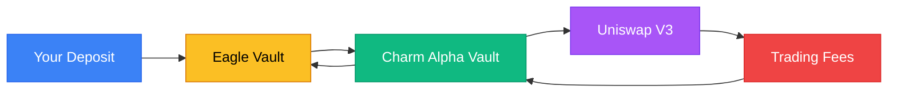

# How it Works

**Understanding Eagle Finance's cross-chain liquidity management system.**

---

## The Full Journey

### 1. You Deposit (Any Chain)

Connect your wallet on **Arbitrum, Base, BSC, Avalanche, or Ethereum**. Deposit WLFI, USD1, or both tokens.

You instantly receive **vault shares** — omnichain tokens that represent your ownership.

### 2. Tokens Deploy to Uniswap V3

Your deposit is automatically bridged to Ethereum (via LayerZero V2) and deployed into **Uniswap V3's WLFI/USD1 pool**.

This happens behind the scenes — you don't need to do anything.

### 3. Charm Finance Manages Your Position

**Charm Finance Alpha Vaults** take over:

- **24/7 Automated Rebalancing** — Positions adjust to market conditions
- **Fee Optimization** — Liquidity concentrates where trading happens
- **Risk Management** — Continuous monitoring for impermanent loss
- **Compounding** — Fees automatically reinvest

### 4. Your Shares Grow in Value

As the vault earns trading fees, your shares become worth more. No action needed from you — value grows automatically.

**Example:**
- Deposit $1,000 → Get 100 shares
- Vault earns $100 in fees (10% total)
- Your 100 shares now worth $1,100
- Profit: $100

### 5. Withdraw Anytime, Anywhere

Burn your vault shares to withdraw. Choose **any supported chain** — not just where you deposited.

The vault automatically:
1. Removes your liquidity from Uniswap V3
2. Bridges tokens to your chosen chain (via LayerZero)
3. Sends you WLFI, USD1, or both — including all earnings

**No lock-ups. No penalties. Complete freedom.**

---

## Strategy Details

### Liquidity Concentration

The visualization above shows how your liquidity deploys across different price ranges:

- **Full Range**: Baseline liquidity across all prices (always active)
- **Base Order**: Concentrated around current price (higher fees)
- **Limit Order**: Strategic positioning for expected price movements

Toggle **Token View** to see how your position splits between USD1 and WLFI at the current price.

### Dynamic Rebalancing

Charm Finance continuously adjusts positions based on:
- Trading volume and volatility
- Fee tier performance
- Price movements
- Market depth

This ensures your capital always works optimally.

---

## Live Pool Data

When connected to mainnet, the visualization displays real-time data from the Uniswap V3 Subgraph:

- Current pool price
- 24-hour trading volume
- Fee generation rates
- Total value locked
- APR projections

---

## Next Steps

<a href="/user/getting-started" style={{ padding: '0.75rem 1.5rem', backgroundColor: '#2563eb', color: 'white', borderRadius: '0.5rem', textDecoration: 'none', fontWeight: '500' }}>
  Getting Started →
</a>

<a href="/user/faq" style={{ padding: '0.75rem 1.5rem', backgroundColor: '#6b7280', color: 'white', borderRadius: '0.5rem', textDecoration: 'none', fontWeight: '500' }}>
  FAQ →
</a>

---

*Powered by Charm Finance Alpha Vaults • Built on Uniswap V3 • Connected via LayerZero V2*
